# รายงานสรุปผลการส่งมอบงานและการพัฒนาโปรเจกต์ (Work Handover Report - ฉบับละเอียด 37 วัน)

## 📌 ภาพรวมโปรเจกต์และขอบเขตงาน (Project Overview & Scope)
เอกสารฉบับนี้เป็นรายงานสรุปผลการปฏิบัติงานและการส่งมอบงาน (Work Handover Report) ครอบคลุมระยะเวลาการพัฒนา **37 วันทำการ (37-Day Development Cycle)** ซึ่งอ้างอิงจากประวัติการทำงานจริงบน Git Commit History โดยแบ่งโครงสร้างของรายงานออกเป็น 2 ส่วนหลัก:

- **ส่วนที่ 1 (Part 1: Day 1 – 17):** ระบบกระบวนการไทม์ไลน์ขอซื้อ/ขอจ้าง (Requisition Timeline), ระบบส่งออกรายงาน (Export & Reporting) และการปรับปรุง UX ระบบประเมินรถ (Car Feedback)
- **ส่วนที่ 2 (Part 2: Day 18 – 37):** ระบบงบประมาณ MAS และเครื่องมือจัดการรายงาน Excel ขั้นสูง, การปรับปรุงระบบจัดซื้อพื้นฐาน, โครงสร้างพื้นฐาน Worker และการแจ้งเตือน, ระบบขอใช้รถและพิมพ์เอกสารราชการพร้อมลายเซ็น, การ Refactor โครงสร้างข้อมูล, หน้าระบบคู่มือผู้ใช้ และชุดทดสอบอัตโนมัติ (Pytest)

### 🏛️ สรุปโมดูลหลักที่ส่งมอบ (8 ฟีเจอร์หลัก)
1. **Feature A:** Requisition Timeline Workflow (ระบบกระบวนการไทม์ไลน์ขอซื้อ/ขอจ้าง) — *Day 1 ถึง 8*
2. **Feature B:** Export and Reporting (ระบบส่งออกไฟล์และรายงานข้อมูล) — *Day 9 ถึง 13*
3. **Feature C:** Car Feedback and UI/UX Modernization (ระบบประเมินการใช้รถและปรับปรุง UI/UX) — *Day 14 ถึง 17*
4. **Feature D:** MAS Budget & Custom Excel Engine (ระบบงบประมาณ MAS และจัดการไฟล์ Excel) — *Day 18 ถึง 22* [5 วัน]
5. **Feature E:** Procurement Baseline & Filtering (ระบบจัดซื้อพื้นฐานและการสืบค้น) — *Day 23 ถึง 25* [3 วัน]
6. **Feature F:** Background Worker & Mail Subsystem (ระบบงานเบื้องหลังและส่งอีเมลแจ้งเตือน) — *Day 26* [1 วัน]
7. **Feature G:** Car Approval & Printable Audit Trail (ระบบอนุมัติขอใช้รถและพิมพ์เอกสารพร้อมลายเซ็น) — *Day 27 ถึง 31* [5 วัน]
8. **Feature H:** Schema Refactor, Manuals & Automated Pytest (ปรับปรุงโครงสร้าง, คู่มือระบบ และชุดทดสอบ) — *Day 32 ถึง 37* [6 วัน]

---

# 📦 ส่วนที่ 1: การส่งมอบงานหลักช่วงแรก (Part 1: Day 1 – 17)

## Feature A: Requisition Timeline Workflow (ระบบกระบวนการไทม์ไลน์ขอซื้อ/ขอจ้าง)

### Day 1 — การตั้งค่าระบบพื้นฐานและความพร้อมของกระบวนการ
- **สิ่งที่ได้พัฒนา / ปรับปรุง:**
  - เพิ่มหน้ารายการแบบฟอร์มที่เสร็จสมบูรณ์พร้อมระบบ Running Number เลขที่เอกสาร (`e9f05ca`)
  - ปรับปรุงการสืบค้นข้อมูลพัสดุในคลังโดยเพิ่มเงื่อนไขกรองเฉพาะสถานะ Active (`1e64902`)
  - เพิ่มตัวเลือก `hide_label` ในฟอร์มมาโคร และปรับปรุง UI ตารางรายการขอซื้อ/ขอจ้าง (`1f4da84`)
- **รายละเอียดเชิงเทคนิค:**
  - เพิ่ม Filter ในระดับ Query Layer เพื่อป้องกันไม่ให้ข้อมูลพัสดุที่ถูกยกเลิก (Inactive) แสดงปะปนในรายการทำงาน
  - ปรับแต่ง Template Macro เพื่อลดความซ้ำซ้อนของโค้ดในการควบคุมการแสดงผล Label ของแบบฟอร์ม
- **การตัดสินใจเชิงสถาปัตยกรรมและตรรกะระบบ:**
  - วางรากฐานและจัดระเบียบพฤติกรรมข้อมูลพื้นฐานให้ถูกต้อง ก่อนเริ่มพัฒนาระบบ State Transition ที่ซับซ้อนขึ้น
- **คุณภาพระบบ Backend / Frontend:**
  - ซิงโครไนซ์การกรองข้อมูลฝั่ง Backend และการจัดโครงสร้างมาโครฝั่ง Frontend ให้สอดคล้องกันอย่างสมบูรณ์

### Day 2 — การแยกย่อยขั้นตอนกระบวนการและทำ Component ค้นหา
- **สิ่งที่ได้พัฒนา / ปรับปรุง:**
  - เพิ่มขั้นตอน `details_specified` (ระบุรายละเอียด) พร้อมแบบฟอร์มและเทมเพลตเฉพาะ (`a58dac3`)
  - พัฒนาระบบกรองข้อมูลคำขอสำหรับหน้ารายการขอซื้อและหน้ารายการขอต่ออายุ (`2937868`)
  - ปรับปรุงฟอร์มค้นหาให้เป็น Reusable Components ที่ใช้ร่วมกันได้ (`3135a97`)
  - ปรับปรุง UI หน้าสินค้าจัดซื้อและพฤติกรรมของ Select-field (`baab092`)
  - แก้ไขปัญหาการแสดงผลตารางสินค้าในระบบจัดซื้อ (`d3aecae`)
  - แก้ไขข้อผิดพลาดของระบบส่งออก MAS ระหว่างการทดสอบเชื่อมต่อ (`77c84b6`)
- **รายละเอียดเชิงเทคนิค:**
  - แยก Search/Filter Logic ออกเป็น Component ช่วยให้การจัดการตัวกรองบนหลายหน้าจอเป็นไปในทิศทางเดียวกัน
- **การตัดสินใจเชิงสถาปัตยกรรมและตรรกะระบบ:**
  - แยก Step Templates ตามบริบทของกระบวนการทำงาน เพื่อลดความซับซ้อนของการเขียนเงื่อนไขเรนเดอร์ในไฟล์เดียว
- **คุณภาพระบบ Backend / Frontend:**
  - เพิ่ม Engineering Workflow และ Asset อ้างอิงเพื่อสนับสนุนมาตรฐานการพัฒนาที่สม่ำเสมอ (`0c21f51`)

### Day 3 — การวางโครงสร้างระบบกรองข้อมูลไทม์ไลน์
- **สิ่งที่ได้พัฒนา / ปรับปรุง:**
  - เพิ่มแบบฟอร์มตัวกรองสำหรับ Requisition Timeline (`0ff20de`)
- **รายละเอียดเชิงเทคนิค:**
  - สร้าง Input Surface ที่ปลอดภัยสำหรับการรับค่าและจำกัดขอบเขตการดึงข้อมูลไทม์ไลน์
- **การตัดสินใจเชิงสถาปัตยกรรมและตรรกะระบบ:**
  - ใช้กลยุทธ์ Filter-First เพื่อรองรับการแบ่งหน้า (Pagination) และเงื่อนไขสถานะในอนาคต
- **คุณภาพระบบ Backend / Frontend:**
  - กำหนด Contract ระหว่างอินพุตฝั่ง Frontend และ Query Parameters ฝั่ง Backend อย่างชัดเจน

### Day 4 — การขยายสถานะกระบวนการ (ยืนยันแหล่งเงินทุน)
- **สิ่งที่ได้พัฒนา / ปรับปรุง:**
  - เพิ่มขั้นตอน Step 4 สำหรับการยืนยันแหล่งเงินทุน (Funding Source Confirmation) (`20bde89`)
  - ดำเนินการซิงโครไนซ์โค้ดกับสถานะล่าสุดของ Integration Branch (`063e839`)
- **รายละเอียดเชิงเทคนิค:**
  - เพิ่ม Checkpoint ที่ชัดเจนใน State Model ของ Requisition Timeline
- **การตัดสินใจเชิงสถาปัตยกรรมและตรรกะระบบ:**
  - ยกระดับขั้นตอนการยืนยันเงินทุนให้เป็นสถานะที่ชัดเจน เพื่อให้สามารถตรวจสอบย้อนกลับ (Traceability) ได้อย่างโปร่งใส
- **คุณภาพระบบ Backend / Frontend:**
  - การซิงค์ Branch ช่วยลดความเสี่ยงจาก Merge Conflict ก่อนเริ่มปรับปรุง Step Engine ครั้งใหญ่

### Day 5 — การปรับปรุงและจัดระเบียบ Step Engine
- **สิ่งที่ได้พัฒนา / ปรับปรุง:**
  - Refactor UI และตรรกะของ Requisition Timeline เพื่อรองรับขั้นตอนจัดซื้อใหม่ๆ (`835c6b7`)
- **รายละเอียดเชิงเทคนิค:**
  - ปรับปรุงการส่งผ่านข้อมูล (Rendering Contracts) ของ Timeline เพื่อรองรับ Metadata ของแต่ละขั้นตอนที่ขยายเพิ่ม
- **การตัดสินใจเชิงสถาปัตยกรรมและตรรกะระบบ:**
  - เลือกใช้ Progression Model แบบรวมศูนย์ แทนการเขียนเงื่อนไขดักรายขั้นตอนแบบแยกส่วน
- **คุณภาพระบบ Backend / Frontend:**
  - วางรากฐานสำหรับการควบคุมสถานะ Readonly และการทำ Action เมื่อจบกระบวนการ

### Day 6 — การปรับปรุงกฎเกณฑ์ทางธุรกิจ (Business Rules)
- **สิ่งที่ได้พัฒนา / ปรับปรุง:**
  - ปรับเปลี่ยนพฤติกรรมการทำงานของขั้นตอนปัจจุบัน (`41c912f`)
  - ตัดตัวเลือกวิธีจัดซื้อที่ไม่ชัดเจนออก และเชื่อมโยงข้อมูลแผนบัญชีงบประมาณ (`e95da11`)
  - ปรับแก้ข้อความ Label แสดงยอดเงินในฟอร์มและเทมเพลตจัดซื้อให้ชัดเจน (`4357dd5`)
  - ปรับปรุง UX การเลือก MAS จากรูปแบบ Toggle มาเป็น Checkbox (`353f5c3`)
- **รายละเอียดเชิงเทคนิค:**
  - ปรับนิยามของกฎเกณฑ์และคำศัพท์ที่แสดงต่อผู้ใช้ให้ตรงกับวัตถุประสงค์ของกระบวนการจัดซื้อจริง
- **การตัดสินใจเชิงสถาปัตยกรรมและตรรกะระบบ:**
  - ให้ความสำคัญกับความถูกต้องของความหมาย (Semantic Consistency) ทั้งบน Label, ตัวเลือก และการเปลี่ยนสถานะ
- **คุณภาพระบบ Backend / Frontend:**
  - ลดความสับสนของผู้ใช้งาน และทำให้พฤติกรรมของฟอร์มมีความแน่นอนและแม่นยำ

### Day 7 — การควบคุมขั้นตอนเสร็จสมบูรณ์และการเชื่อมโยงการตรวจรับพัสดุ
- **สิ่งที่ได้พัฒนา / ปรับปรุง:**
  - เพิ่มโมดูล Requisition Timeline Items พร้อมระบบค้นหาและแสดงผล (`da21c12`)
  - เพิ่มปุ่ม Action สำหรับดูรายละเอียดแบบ Readonly ในแต่ละขั้นตอน (`7f4ab29`, `dcecdc2`)
  - เพิ่มขั้นตอนความคืบหน้า `payment_processed` (ประมวลผลการจ่ายเงิน) (`d08d6a0`)
  - เพิ่มฟิลด์วันที่ตรวจรับพัสดุและเชื่อมโยงเข้ากับระบบสถานะ (`4ec209c`, `74ee68c`)
  - ซิงค์โค้ดกับ Integration Branch (`d1402c2`)
- **รายละเอียดเชิงเทคนิค:**
  - State Machine ของ Timeline ครอบคลุมไปจนถึงขั้นตอนหลังประมวลผลและ Milestone การตรวจรับพัสดุ
- **การตัดสินใจเชิงสถาปัตยกรรมและตรรกะระบบ:**
  - บังคับใช้การแยกสิทธิ์อย่างเด็ดขาดระหว่างเส้นทางการแก้ไขข้อมูล (Editable Path) และเส้นทางการตรวจสอบ (Audit/Review Path)
- **คุณภาพระบบ Backend / Frontend:**
  - เพิ่มการกำกับดูแลความปลอดภัย และป้องกันไม่ให้มีการแก้ไขข้อมูลย้อนหลังในสถานะที่ปิดงานแล้ว

### Day 8 — การแสดงผลข้อมูลและการปรับ UI ไทม์ไลน์ให้รองรับ Responsive
- **สิ่งที่ได้พัฒนา / ปรับปรุง:**
  - เพิ่มการแสดงผลวันที่สร้างและปรับปรุงตรรกะการกรองข้อมูลสำหรับ Timeline Items (`92932c0`)
  - เพิ่ม Method คำนวณระยะเวลาประกันและอัปเดตตารางไทม์ไลน์ (`3cf3975`)
  - ปรับเปลี่ยนตาราง Requisition Timeline ให้เป็น Card-based Layout สำหรับมือถือ (`874d890`)
  - บังคับใช้สถานะ Readonly กับฟิลด์ในฟอร์มผ่าน Template Parameters (`93b9fbe`)
  - เพิ่มคอมโพเนนต์ Flash-card UI (`749ef42`)
- **รายละเอียดเชิงเทคนิค:**
  - คำนวณค่าทางธุรกิจ (เช่น ระยะเวลาประกัน) ในระดับ Model Layer แล้วส่งไปแสดงผลบน UI
- **การตัดสินใจเชิงสถาปัตยกรรมและตรรกะระบบ:**
  - แยกการคำนวณทางธุรกิจออกจาก Template โดยให้อยู่ในฝั่ง Model/Business Layer
- **คุณภาพระบบ Backend / Frontend:**
  - เพิ่มความสะดวกในการอ่านข้อมูล ใช้งานได้ดีบนอุปกรณ์เคลื่อนที่ และปลอดภัยในโหมด Review

---

## Feature B: Export and Reporting (ระบบส่งออกไฟล์และรายงานข้อมูล)

### Day 9 — การริเริ่มสร้างโมดูลส่งออกรายงาน
- **สิ่งที่ได้พัฒนา / ปรับปรุง:**
  - พัฒนาระบบส่งออก Requisition Timeline Items พร้อมรองรับ Modal โต้ตอบ (`3ab2d6f`)
  - เพิ่มฟิลด์ `type` ในโมเดล `ExportFile` และอัปเดตระบบประมวลผลการส่งออก (`774eef5`)
- **รายละเอียดเชิงเทคนิค:**
  - โครงสร้าง Metadata ของการส่งออกสามารถจำแนกประเภทและบริบทของรายงานได้
- **การตัดสินใจเชิงสถาปัตยกรรมและตรรกะระบบ:**
  - เลือกการออกแบบ Typed Export เพื่อรองรับการขยายประเภทรายงานในอนาคตได้อย่างยืดหยุ่น
- **คุณภาพระบบ Backend / Frontend:**
  - เชื่อมโยง Flow การรับค่าจาก Modal บนหน้าเว็บเข้ากับ Backend Export Processing

### Day 10 — การตรวจสอบความถูกต้องของช่วงวันที่และการส่งออกระดับ Item
- **สิ่งที่ได้พัฒนา / ปรับปรุง:**
  - เสริมระบบส่งออกด้วยการตรวจสอบความถูกต้องของวันที่ (Date Validation) บน Modal (`f09535e`)
  - เพิ่มความสามารถในการส่งออกรายการพัสดุ (Requisition Items Export) (`52382d0`)
- **รายละเอียดเชิงเทคนิค:**
  - สร้าง Validation Gate เพื่อดักจับและป้องกันการระบุช่วงวันที่ไม่ถูกต้องก่อนเริ่ม Generate ไฟล์
- **การตัดสินใจเชิงสถาปัตยกรรมและตรรกะระบบ:**
  - ใช้แนวทาง Validation-First เพื่อปกป้องความถูกต้องและความน่าเชื่อถือของรายงาน
- **คุณภาพระบบ Backend / Frontend:**
  - ขยายขอบเขตการออกรายงานจากเดิมที่มีเฉพาะ Timeline ให้ครอบคลุมถึงระดับ Requisition Items

### Day 11 — การปรับปรุงการจัดรูปแบบรายงานและความถูกต้องของวันที่
- **สิ่งที่ได้พัฒนา / ปรับปรุง:**
  - Refactor ระบบส่งออกและปรับปรุงการจัดรูปแบบส่วนหัวตาราง (Headers) ในรายงาน (`0752150`)
  - แก้ไขการจัดฟอร์แมตวันที่นับถอยหลัง (Countdown) ใน Requisition Timeline (`4953cb6`)
- **รายละเอียดเชิงเทคนิค:**
  - ปรับมาตรฐาน Output Formatting และการแสดงผลวันที่ให้เป็นรูปแบบเดียวกันทั้งระบบ
- **การตัดสินใจเชิงสถาปัตยกรรมและตรรกะระบบ:**
  - ความชัดเจนของรายงานและความถูกต้องของวันที่ถือเป็นคุณภาพระดับ Release-critical
- **คุณภาพระบบ Backend / Frontend:**
  - ลดความคลาดเคลื่อนระหว่างข้อมูลวันที่แสดงบนหน้าจอกับข้อมูลในไฟล์ที่ส่งออก

### Day 12 — ตรรกะการคำนวณราคาและการสืบค้นตามช่วงเวลา
- **สิ่งที่ได้พัฒนา / ปรับปรุง:**
  - เปลี่ยนการอ้างอิง `fund_allocation` id มาเป็น `item_id` และเพิ่มการคำนวณราคาสุทธิคูณจำนวน (`1aef32a`)
  - เพิ่มฟิลเตอร์กรองตามช่วงวันหมดอายุสัญญาในวิวและฟอร์มจัดซื้อ (`c1c4d9a`)
  - เพิ่มการเรียงลำดับรายการตามวันหมดอายุในหน้า Index (`665a057`)
  - ตัด Action ที่ไม่จำเป็นบน Timeline ออก และปรับความกว้างคอลัมน์ผู้รับผิดชอบ (`a0ac0c3`, `941b5fe`)
- **รายละเอียดเชิงเทคนิค:**
  - ผลรวมยอดเงินคำนวณคูณตามจำนวนชิ้นจริงใน Business Logic
  - การ Query รองรับการกรองช่วงวันหมดอายุและเรียงลำดับแบบ Deterministic Expiry Ordering
- **การตัดสินใจเชิงสถาปัตยกรรมและตรรกะระบบ:**
  - รวมศูนย์ตรรกะทางการเงินและการจัดเรียงลำดับไว้ที่ Backend เพื่อความแม่นยำสูงสุด
- **คุณภาพระบบ Backend / Frontend:**
  - เพิ่มความสะดวกรวดเร็วในการติดตามรายการจัดซื้อที่ใกล้ครบกำหนดสัญญา

### Day 13 — การสืบค้นข้อมูลประสิทธิภาพสูงและการจำกัดสิทธิ์ Action
- **สิ่งที่ได้พัฒนา / ปรับปรุง:**
  - เพิ่มระบบแบ่งหน้า (Pagination) และการกรองตามผู้ใช้งานสำหรับ Timeline Items (`4ccd092`)
  - เพิ่มฟิลเตอร์สถานะ Expired และจำกัดปุ่ม Action ให้กดได้เฉพาะสถานะ Pending (`c42a697`)
- **รายละเอียดเชิงเทคนิค:**
  - ปรับปรุงการสืบค้นข้อมูลให้รองรับชุดข้อมูลขนาดใหญ่ได้อย่างรวดเร็ว
- **การตัดสินใจเชิงสถาปัตยกรรมและตรรกะระบบ:**
  - ผสานการตรวจสอบสถานะฝั่ง Backend และการล็อกปุ่มฝั่ง Frontend เพื่อป้องกันการเปลี่ยนสถานะผิดพลาด
- **คุณภาพระบบ Backend / Frontend:**
  - เพิ่ม Performance ของระบบเมื่อมีข้อมูลจำนวนมาก และปิดกั้น Invalid Action Paths

---

## Feature C: Car Feedback and UI/UX Modernization (ระบบประเมินการใช้รถและปรับปรุง UI/UX)

### Day 14 — การเสริมความแข็งแกร่งของ Shared Form Rendering
- **สิ่งที่ได้พัฒนา / ปรับปรุง:**
  - Refactor ระบบแสดงผลฟิลด์ในฟอร์มให้รองรับ Dynamic Styles และการแสดง Error ตามเงื่อนไข (`b50dc5d`)
- **รายละเอียดเชิงเทคนิค:**
  - เลเยอร์การเรนเดอร์ฟอร์มส่วนกลางรองรับการปรับแต่งสไตล์และข้อความแจ้งเตือนแบบยืดหยุ่น
- **การตัดสินใจเชิงสถาปัตยกรรมและตรรกะระบบ:**
  - เสริมความแข็งแกร่งของระบบฟอร์มส่วนกลางให้พร้อม ก่อนเริ่มปล่อยระบบ Feedback แบบไดนามิก
- **คุณภาพระบบ Backend / Frontend:**
  - เพิ่มความสม่ำเสมอและความสะดวกในการดูแลรักษาโค้ดหน้าจอที่มีแบบฟอร์มจำนวนมาก

### Day 15 — การโต้ตอบกับรูปภาพและสร้างหน้าประเมินการใช้รถ
- **สิ่งที่ได้พัฒนา / ปรับปรุง:**
  - ปรับปรุงการแสดงรูปภาพและเพิ่ม Modal ดูภาพขนาดเต็ม (`6e7bb39`)
  - เพิ่มหน้าระบบประเมินความพึงพอใจการใช้รถยนต์โดยเฉพาะ (`ed0d6e0`)
- **รายละเอียดเชิงเทคนิค:**
  - เพิ่มการดูพรีวิวรูปภาพเพื่อช่วยให้ผู้ใช้ตรวจสอบความถูกต้องของสภาพรถได้อย่างชัดเจน
- **การตัดสินใจเชิงสถาปัตยกรรมและตรรกะระบบ:**
  - แยกหน้าประเมินความพึงพอใจออกมาเป็นหน้าจอเฉพาะเพื่อลดภาระทางสายตาของผู้ใช้งาน
- **คุณภาพระบบ Backend / Frontend:**
  - เพิ่มความมั่นใจในการกรอกข้อมูลและลดข้อผิดพลาดด้วยการมีภาพประกอบที่ชัดเจน

### Day 16 — การพัฒนาระบบ Dynamic Feedback Engine
- **สิ่งที่ได้พัฒนา / ปรับปรุง:**
  - พัฒนาระบบ Dynamic Car Feedback ที่รองรับคำถามหลากหลายประเภทและคอมโพเนนต์แสดงผลแบบยืดหยุ่น (`a9af0a4`)
  - ปรับปรุงชื่อ Dashboard ให้สอดคล้องกับฟีเจอร์ (`afd2da8`)
- **รายละเอียดเชิงเทคนิค:**
  - เปลี่ยนจากการเขียนฟิลด์แบบ Static มาเป็นการเรนเดอร์ตามประเภทของคำถาม (Configuration-driven Rendering)
- **การตัดสินใจเชิงสถาปัตยกรรมและตรรกะระบบ:**
  - ใช้สถาปัตยกรรมแบบ Dynamic Form เพื่อรองรับการปรับเปลี่ยนชุดคำถามในอนาคตได้ง่ายโดยไม่ต้องแก้โค้ดหลัก
- **คุณภาพระบบ Backend / Frontend:**
  - ลดภาระงานในการเพิ่มหรือแก้ไขคำถามประเมินในอนาคต

### Day 17 — การแก้ไขบั๊กและเตรียมความพร้อมสำหรับการส่งมอบ
- **สิ่งที่ได้พัฒนา / ปรับปรุง:**
  - แก้ไขพฤติกรรมการทำงานของปุ่ม Copy ลิงก์ (`147d6a0`)
  - แก้ไขระบบ Copy QR Code (`f5fad12`)
  - แก้ไขปัญหา Validation ลิงก์บน Staging (`06e2517`)
  - เพิ่มตัวเลือกการเลือกหลายคัน (Multi-car Selection) ในฟอร์ม (`e4b31a6`)
- **รายละเอียดเชิงเทคนิค:**
  - ปรับปรุงความน่าเชื่อถือของการคัดลอกลง Clipboard และการแชร์ลิงก์
- **การตัดสินใจเชิงสถาปัตยกรรมและตรรกะระบบ:**
  - ให้ความสำคัญกับการแก้ไขบั๊กที่มีผลต่อการใช้งานจริงเพื่อความพร้อมในการขึ้นระบบ
- **คุณภาพระบบ Backend / Frontend:**
  - ปิดรอบการพัฒนาด้วยการแก้บั๊ก Regression และปรับปรุง UX ขั้นสุดท้าย

---

# 📦 ส่วนที่ 2: การส่งมอบฟีเจอร์ขยายความสามารถระบบ (Part 2: Day 18 – 37)

## Feature D: MAS Budget & Custom Excel Engine (Day 18 – 22) [5 วัน]

### Day 18 — โครงสร้างโมเดล MAS, การรองรับปีงบประมาณ และฟอร์มอัปโหลด
- **สิ่งที่ได้พัฒนา / ปรับปรุง:**
  - Refactor ฟอร์ม MAS และฟอร์มอัปโหลดไฟล์แบบไดนามิก (`a77c41b`, `06a71ed`)
  - เพิ่มฟิลด์ `year` ในโมเดล `MAS` สำหรับแยกแยะปีงบประมาณ (`cabecb7`)
- **รายละเอียดเชิงเทคนิค:**
  - ขยาย Schema MongoEngine `MAS` ให้รองรับรอบปีงบประมาณ พร้อมปรับปรุงการตรวจสอบ WTForms
- **การตัดสินใจเชิงสถาปัตยกรรมและตรรกะระบบ:**
  - รองรับการบริหารงบประมาณแบบข้ามปีตามรอบปีบัญชีขององค์กร
- **คุณภาพระบบ Backend / Frontend:**
  - ปรับปรุง Template ฟอร์มให้กระชับ และมีข้อความแจ้งเตือนผลการอัปโหลดไฟล์ Excel อย่างชัดเจน
- **📸 ภาพหน้าจอประกอบ (Screenshot):**
  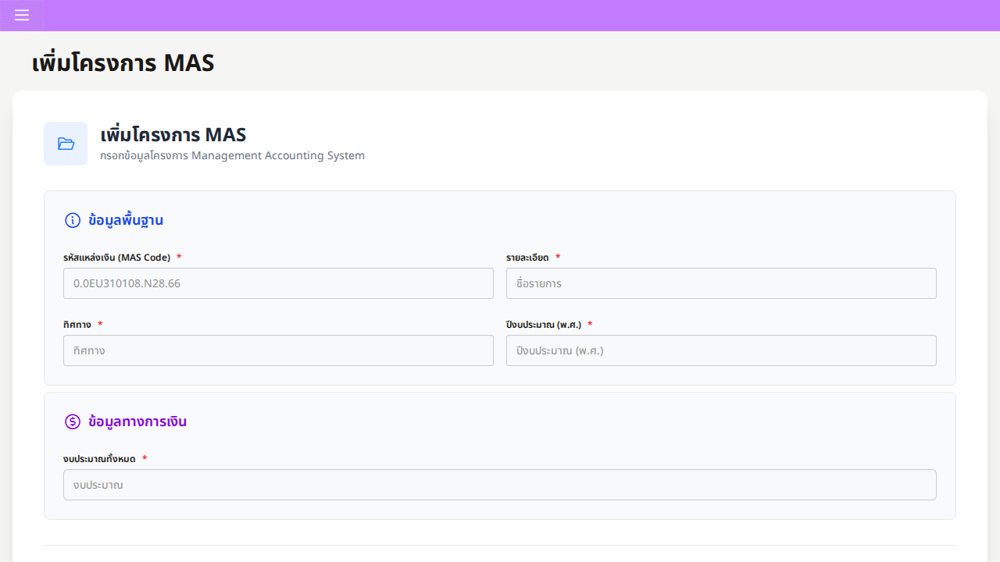

### Day 19 — โมเดล ExportFile และรากฐานระบบส่งออก Excel MAS
- **สิ่งที่ได้พัฒนา / ปรับปรุง:**
  - สร้างโมเดล `ExportFile` และฟังก์ชันส่งออก Excel งบประมาณ MAS (`a15d4bc`)
  - Refactor การประมวลผลไฟล์ส่งออกและการส่งคืนข้อมูลสตรีม (`d1e2686`)
- **รายละเอียดเชิงเทคนิค:**
  - พัฒนา Backend Service สร้างไฟล์ Excel หลากหลายคอลัมน์ พร้อมผูก Action เข้ากับ Modal Dialog
- **การตัดสินใจเชิงสถาปัตยกรรมและตรรกะระบบ:**
  - บันทึก Metadata ของการส่งออกลงฐานข้อมูลเพื่อให้สามารถตรวจสอบประวัติและดาวน์โหลดซ้ำได้
- **คุณภาพระบบ Backend / Frontend:**
  - ป้องกันปัญหา Request Timeout เมื่อส่งออกข้อมูลขนาดใหญ่
- **📸 ภาพหน้าจอประกอบ (Screenshot):**
  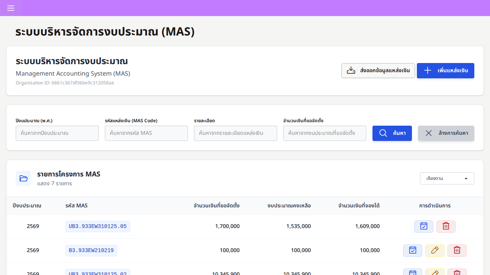

### Day 20 — การจัดรูปแบบ Excel ขั้นสูง (openpyxl), สูตรคำนวณเงิน และวันที่ พ.ศ.
- **สิ่งที่ได้พัฒนา / ปรับปรุง:**
  - ยกระดับการจัดสไตล์ Excel ด้วยเส้นขอบ สีพื้นหลัง สีตัวอักษร และสูตรคำนวณยอดเงินรวมอัตโนมัติ (`084e880`)
  - เพิ่มตัวกรองช่วงวันที่และระบบแปลงวันที่เป็น พ.ศ. (Thai Buddhist Date) (`8eb4e9e`)
- **รายละเอียดเชิงเทคนิค:**
  - สร้าง `date_utils.py` สำหรับจัดการแปลงวันที่ และจัดสไตล์ชีต Excel ให้ตรงตามระเบียบรายงานทางการ
- **การตัดสินใจเชิงสถาปัตยกรรมและตรรกะระบบ:**
  - เปลี่ยนจากการส่งออกตารางดิบธรรมดาให้กลายเป็นรายงานทางการที่พร้อมนำไปใช้งานได้ทันที
- **คุณภาพระบบ Backend / Frontend:**
  - รับประกันความถูกต้องของตัวเลขการเงินด้วย `DecimalField` โดยไม่เกิดปัญหาทศนิยมคลาดเคลื่อน
- **📸 ภาพหน้าจอประกอบ (Screenshot):**
  

### Day 21 — สถาปัตยกรรม Sub-table แสดงรายการที่ผูกกับการจองงบ MAS
- **สิ่งที่ได้พัฒนา / ปรับปรุง:**
  - พัฒนาระบบแสดงตารางย่อย (Sub-table) สำหรับรายการที่จองงบประมาณ MAS (`a46fa09`)
- **รายละเอียดเชิงเทคนิค:**
  - สร้างมาโคร `items_sub_table.html` เพื่อแสดงรายการขอซื้อ/ขอจ้างที่อยู่ภายใต้การกันงบแต่ละรายการ
- **การตัดสินใจเชิงสถาปัตยกรรมและตรรกะระบบ:**
  - สร้างลำดับชั้นข้อมูลให้เห็นชัดเจนว่าแต่ละงบประมาณถูกนำไปใช้กับรายการพัสดุใดบ้าง
- **คุณภาพระบบ Backend / Frontend:**
  - เพิ่มความโปร่งใสให้ผู้ตรวจสอบบัญชีและฝ่ายพัสดุสามารถตรวจสอบที่มาของเงินได้อย่างละเอียด
- **📸 ภาพหน้าจอประกอบ (Screenshot):**
  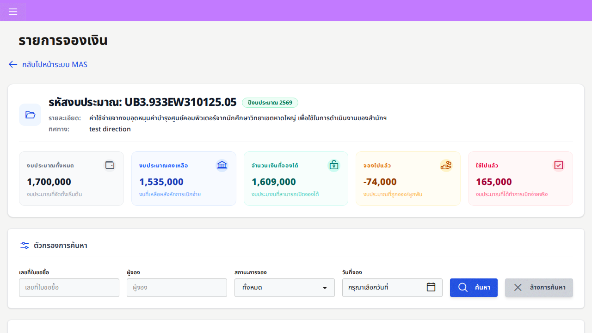

### Day 22 — ระบบค้นหา MAS หลายเงื่อนไข, ประวัติการจอง และปรับแต่ง UI
- **สิ่งที่ได้พัฒนา / ปรับปรุง:**
  - เพิ่มระบบค้นหา MAS กรองตามปี, รหัส MAS, คำอธิบาย และยอดเงิน (`9db165c`)
  - เพิ่มระบบค้นหาประวัติการจองงบประมาณกรองตามรหัสคำขอ, ผู้จอง, สถานะ และวันที่ (`6b5299a`)
  - ขัดเกลา UI หน้า MAS และตารางการจองงบประมาณ (`6bbfa99`, `4788eef`)
- **รายละเอียดเชิงเทคนิค:**
  - สร้าง `forms/mas.py` และ `forms/reservations.py` รองรับ Compound Regex Queries บน MongoEngine
- **การตัดสินใจเชิงสถาปัตยกรรมและตรรกะระบบ:**
  - รวมศูนย์การจัดการงบประมาณและบันทึกการจองไว้ในหน้าแดชบอร์ดที่ใช้งานง่าย
- **คุณภาพระบบ Backend / Frontend:**
  - เชื่อมต่อการทำงานของระบบ MAS ครบวงจร พร้อมตกแต่งด้วย DaisyUI ให้สวยงาม
- **📸 ภาพหน้าจอประกอบ (Screenshot):**
  

---

## Feature E: Procurement Baseline & Filtering (Day 23 – 25) [3 วัน]

### Day 23 — ระบบบันทึกความคิดเห็นในพัสดุและติดตามสถานะการอนุมัติ
- **สิ่งที่ได้พัฒนา / ปรับปรุง:**
  - เพิ่มระบบ Comment ในตารางรายการขอซื้อ/ขอจ้าง (`47bd0e2`)
  - อัปเดตตารางรายการคำขอให้แสดงสถานะการอนุมัติแยกตามบทบาทผู้ใช้ (`51b2b88`, `5e92b81`)
- **รายละเอียดเชิงเทคนิค:**
  - ปรับแต่ง Jinja2 Table Macros ให้เรนเดอร์ความคิดเห็นและ Badge สถานะตาม Role
- **การตัดสินใจเชิงสถาปัตยกรรมและตรรกะระบบ:**
  - สร้างความชัดเจนในรายละเอียดพัสดุและลำดับการอนุมัติตั้งแต่ขั้นตอนแรกของการขอซื้อ
- **คุณภาพระบบ Backend / Frontend:**
  - ลดข้อผิดพลาดในการสื่อสารระหว่างผู้ขอและผู้อนุมัติ
- **📸 ภาพหน้าจอประกอบ (Screenshot):**
  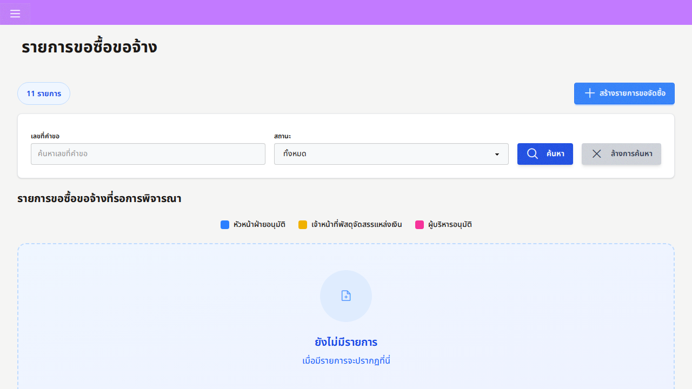

### Day 24 — การสืบค้นพัสดุหลายมิติและการเชื่อมโยงข้ามโมดูล
- **สิ่งที่ได้พัฒนา / ปรับปรุง:**
  - เพิ่มระบบค้นหารายการพัสดุแบบหลายฟิลด์ (ชื่อสินค้า, รหัสสินค้า, หมายเลขครุภัณฑ์) (`9e529f8`)
  - เพิ่มปุ่ม Action ในตารางสินค้าคลังเพื่อเปิดหน้าสร้างคำขอจัดซื้อได้ทันที (`39190c8`)
- **รายละเอียดเชิงเทคนิค:**
  - เพิ่มตรรกะการสืบค้นหลายมิติใน `procurement/requisition.py` พร้อมส่งต่อพารามิเตอร์เชื่อมโยงหน้าจอ
- **การตัดสินใจเชิงสถาปัตยกรรมและตรรกะระบบ:**
  - ลดขั้นตอนการทำงานของผู้ใช้ (Reduced Click-Path UX) จากหน้าคลังสินค้าสู่การเปิดใบขอซื้อ
- **คุณภาพระบบ Backend / Frontend:**
  - ปรับแต่ง Query ให้ตอบสนองรวดเร็วและใช้ Index อย่างมีประสิทธิภาพ
- **📸 ภาพหน้าจอประกอบ (Screenshot):**
  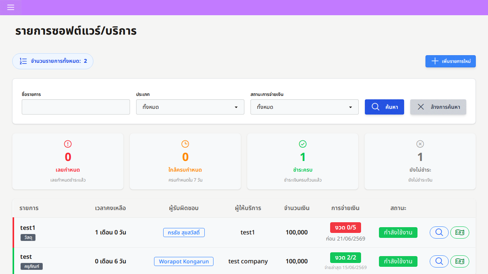

### Day 25 — ฟิลเตอร์คำขอเฉพาะของฉันและการจัดระเบียบเมนู Sidebar
- **สิ่งที่ได้พัฒนา / ปรับปรุง:**
  - เพิ่มตัวกรอง "Only Me" เพื่อดูเฉพาะคำขอที่ตนเองเป็นผู้สร้าง (`f5cd00f`)
  - ปรับปรุงโครงสร้างเมนู Sidebar จัดหมวดหมู่พร้อม Tooltip อธิบาย (`3a978c0`)
- **รายละเอียดเชิงเทคนิค:**
  - เพิ่ม Query Scope `created_by=current_user` และจัดระเบียบ HTML ใน `sidebar-procurement.html`
- **การตัดสินใจเชิงสถาปัตยกรรมและตรรกะระบบ:**
  - ช่วยให้เจ้าหน้าที่ติดตามงานของตนเองได้รวดเร็วโดยไม่ถูกรบกวนด้วยรายการของผู้อื่น
- **คุณภาพระบบ Backend / Frontend:**
  - เพิ่มความสะดวกในการใช้งานบนทุกขนาดหน้าจอด้วย Responsive Collapse
- **📸 ภาพหน้าจอประกอบ (Screenshot):**
  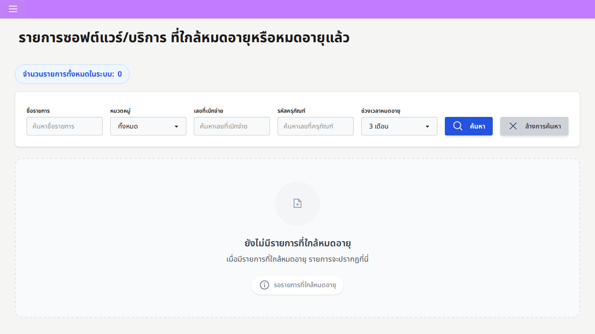

---

## Feature F: Background Worker & Mail Subsystem (Day 26) [1 วัน]

### Day 26 — การจัดการ Host URL สำหรับอีเมล, ตรวจสอบ Worker และ Hardening
- **สิ่งที่ได้พัฒนา / ปรับปรุง:**
  - ตั้งค่า Environment Host URL สำหรับระบบส่งอีเมลแจ้งเตือน (`76cb9c6`)
  - จัดทำระบบตรวจสอบและดักจับ Log การทำงานของ Worker บน Staging (`bbbef0b`, `c55eb05`)
  - ลบคำสั่ง Debug ออกเพื่อความพร้อมสำหรับ Production (`6a62718`)
- **รายละเอียดเชิงเทคนิค:**
  - ปรับปรุง `email_utils.py` และ `rejected_emails.py` ให้รองรับทั้ง Staging และ Production
  - ตรวจสอบคิวงาน Redis RQ, การเชื่อมต่อ SMTP และระบบจัดการความล้มเหลว
- **การตัดสินใจเชิงสถาปัตยกรรมและตรรกะระบบ:**
  - แยกงานส่งอีเมลที่เป็นงาน I/O หนักออกไปประมวลผลเบื้องหลังแบบ Asynchronous
- **คุณภาพระบบ Backend / Frontend:**
  - รับประกันการส่งอีเมลที่เสถียรและไม่ทำให้หน้าเว็บค้างขณะทำรายการ
- **📸 ภาพหน้าจอประกอบ (Screenshot):**
  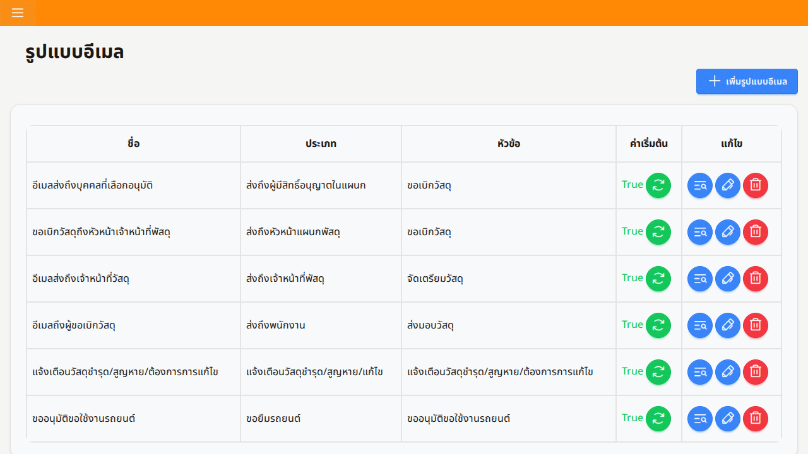

---

## Feature G: Car Approval & Printable Audit Trail (Day 27 – 31) [5 วัน]

### Day 27 — ระบบกระบวนการอนุมัติการขอใช้รถและ Embedded Approvals
- **สิ่งที่ได้พัฒนา / ปรับปรุง:**
  - พัฒนาระบบอนุมัติการขอใช้รถยนต์หลายระดับพร้อมโครงสร้างเก็บประวัติการอนุมัติแบบฝังตัว (`95655c2`)
- **รายละเอียดเชิงเทคนิค:**
  - กำหนด Schema `EmbeddedDocument` สำหรับบันทึกลำดับการอนุมัติ (ผู้ขอ, พนักงานขับรถ, หัวหน้างาน, ผู้บริหาร)
- **การตัดสินใจเชิงสถาปัตยกรรมและตรรกะระบบ:**
  - ฝังประวัติการอนุมัติและ Timestamp ไว้ในตัวเอกสาร เพื่อความโปร่งใสและป้องกันการแก้ไขย้อนหลัง
- **คุณภาพระบบ Backend / Frontend:**
  - มั่นใจในความถูกต้องของ Audit Trail สำหรับการใช้ยานพาหนะของหน่วยงาน
- **📸 ภาพหน้าจอประกอบ (Screenshot):**
  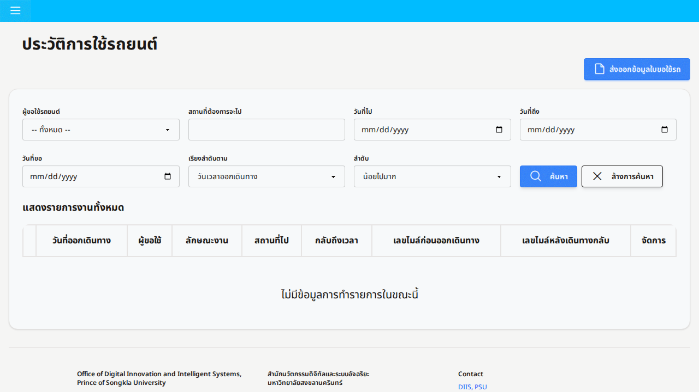

### Day 28 — ระบบสร้างหน้าพิมพ์เอกสารรวมชุด (`combine_paper`)
- **สิ่งที่ได้พัฒนา / ปรับปรุง:**
  - สร้าง Route `combine_paper` สำหรับการสั่งพิมพ์เอกสารขอใช้รถพร้อมกันหลายรายการ (`1ef82a1`)
- **รายละเอียดเชิงเทคนิค:**
  - สร้างระบบเรนเดอร์เอกสารหลายใบต่อเนื่อง พร้อมกำหนด CSS `@media print` จัดการตัดหน้ากระดาษอัตโนมัติ
- **การตัดสินใจเชิงสถาปัตยกรรมและตรรกะระบบ:**
  - เพิ่มความสะดวกให้ฝ่ายยานพาหนะสามารถสั่งพิมพ์ใบขอใช้รถที่อนุมัติแล้วได้ทั้งหมดในคลิกเดียว
- **คุณภาพระบบ Backend / Frontend:**
  - ลดภาระงานเอกสารของเจ้าหน้าที่ได้อย่างมีนัยสำคัญ
- **📸 ภาพหน้าจอประกอบ (Screenshot):**
  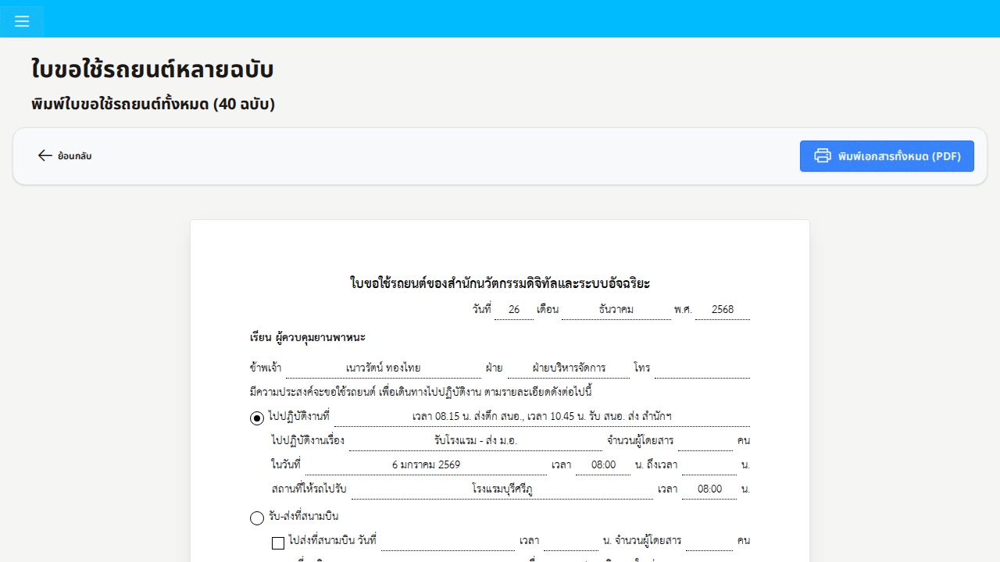

### Day 29 — การจัดรูปแบบหน้าเอกสารราชการพร้อมช่องลายเซ็น
- **สิ่งที่ได้พัฒนา / ปรับปรุง:**
  - จัดทำหน้าเอกสารสั่งพิมพ์แบบทางการพร้อมช่องลงนามและประวัติการอนุมัติ (`ae64bb4`)
- **รายละเอียดเชิงเทคนิค:**
  - วางโครงสร้าง Layout เอกสารราชการตามแบบฟอร์มมาตรฐาน พร้อมช่องลงนามของผู้เกี่ยวข้องทุกฝ่าย
- **การตัดสินใจเชิงสถาปัตยกรรมและตรรกะระบบ:**
  - รักษาความสอดคล้องกับระเบียบเอกสารราชการเพื่อให้สามารถนำไปใช้งานได้จริง
- **คุณภาพระบบ Backend / Frontend:**
  - จัดหน้าพิมพ์แบบ Pixel-Perfect รองรับการพิมพ์ผ่านเบราว์เซอร์ได้อย่างสวยงาม
- **📸 ภาพหน้าจอประกอบ (Screenshot):**
  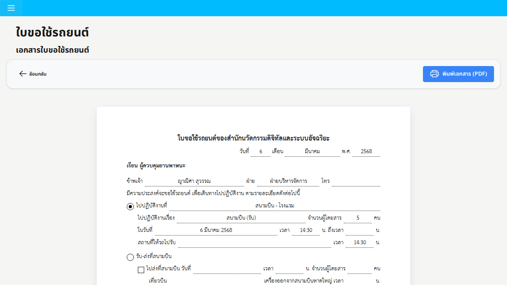

### Day 30 — การเพิ่มช่องลายเซ็นในรายงานประวัติการใช้รถและแก้ระบบ Auth
- **สิ่งที่ได้พัฒนา / ปรับปรุง:**
  - เพิ่มส่วนลงลายเซ็นในรายงานประวัติการใช้รถยนต์ (`6a1640d`, `6013d67`)
  - แก้ไขปัญหา Session ตรวจสอบสิทธิ์ในหน้าพรีวิวเอกสารพิมพ์ (`6013d67`)
- **รายละเอียดเชิงเทคนิค:**
  - เพิ่มเส้นลงนามในไฟล์ประวัติ และปรับปรุง Decorator ตรวจสอบสิทธิ์การเข้าถึงหน้าพิมพ์
- **การตัดสินใจเชิงสถาปัตยกรรมและตรรกะระบบ:**
  - ควบคุมการเข้าถึงเอกสารสำคัญให้ปลอดภัยและอนุญาตเฉพาะผู้มีสิทธิ์
- **คุณภาพระบบ Backend / Frontend:**
  - ป้องกันปัญหา Redirect ที่ผิดพลาดขณะเปิดดูเอกสารพรีวิว
- **📸 ภาพหน้าจอประกอบ (Screenshot):**
  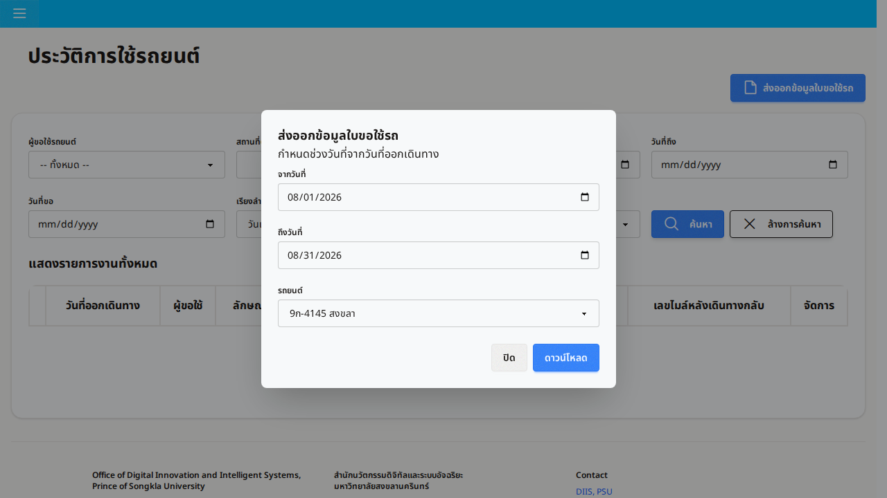

### Day 31 — การยกเครื่องหน้าจอปฏิทินจองรถและ Modal คำขอ
- **สิ่งที่ได้พัฒนา / ปรับปรุง:**
  - ปรับปรุง Modal แสดงรายละเอียด, ตารางคำขอ และหน้าระบบปฏิทินจองรถ (Calendar View) (`044c154`)
- **รายละเอียดเชิงเทคนิค:**
  - ปรับปรุงการแสดง Event ในปฏิทินให้เห็นสถานะรถว่าง, คนขับที่ได้รับมอบหมาย และปลายทาง
- **การตัดสินใจเชิงสถาปัตยกรรมและตรรกะระบบ:**
  - ใช้ปฏิทินแสดงผลแบบ Interactive เพื่อป้องกันการจองรถและคนขับซ้ำซ้อน
- **คุณภาพระบบ Backend / Frontend:**
  - เพิ่มความสะดวกและความรวดเร็วในการจัดสรรยานพาหนะขององค์กร
- **📸 ภาพหน้าจอประกอบ (Screenshot):**
  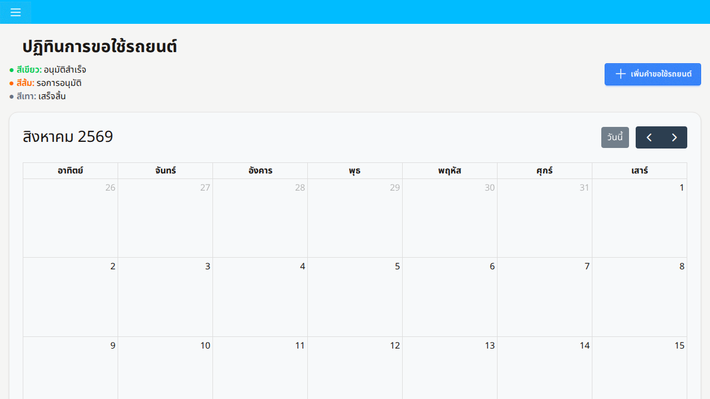

---

## Feature H: Schema Refactor, Manuals & Automated Pytest (Day 32 – 37) [6 วัน]

### Day 32 — การจัดระเบียบชื่อหมวดสินทรัพย์และวางโครงสร้างเอกสารส่งมอบ
- **สิ่งที่ได้พัฒนา / ปรับปรุง:**
  - ปรับชื่อเรียกในหน้าระบบจัดซื้อให้สอดคล้องกับหมวดหมู่สินทรัพย์ (`b1948dd`)
  - ปรับปรุง UI Item Card และเริ่มต้นจัดทำโครงสร้างเอกสาร Handover (`b1948dd`)
- **รายละเอียดเชิงเทคนิค:**
  - ปรับคำศัพท์ทั่วทั้งระบบให้ตรงตามมาตรฐานการเงินและการบริหารสินทรัพย์
- **การตัดสินใจเชิงสถาปัตยกรรมและตรรกะระบบ:**
  - สร้างความเป็นเอกภาพของคำศัพท์ (Domain Terminology) ทั่วทั้ง Codebase
- **คุณภาพระบบ Backend / Frontend:**
  - วางรากฐานที่ดีสำหรับการถ่ายทอดความรู้และการส่งมอบงานให้ทีมงาน
- **📸 ภาพหน้าจอประกอบ (Screenshot):**
  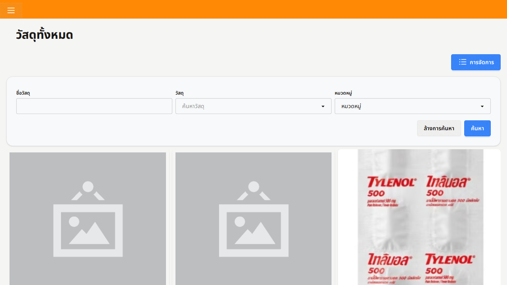

### Day 33 — การ Refactor โครงสร้างข้อมูล (`product_number` ➔ `payment_number`)
- **สิ่งที่ได้พัฒนา / ปรับปรุง:**
  - ปรับเปลี่ยนโครงสร้างฟิลด์และโค้ดทั้งหมดจาก `product_number` เป็น `payment_number` (`653941c`)
- **รายละเอียดเชิงเทคนิค:**
  - อัปเดต Schema MongoEngine, WTForms, Controller Queries และ Template Bindings ทั้งหมด
- **การตัดสินใจเชิงสถาปัตยกรรมและตรรกะระบบ:**
  - แยกความแตกต่างระหว่างรหัสพัสดุและรหัสใบสำคัญจ่ายเงินให้ถูกต้องตามหลักบัญชี
- **คุณภาพระบบ Backend / Frontend:**
  - ตรวจสอบความถูกต้องของการดึงข้อมูลทุกจุดโดยไม่เกิด Regression
- **📸 ภาพหน้าจอประกอบ (Screenshot):**
  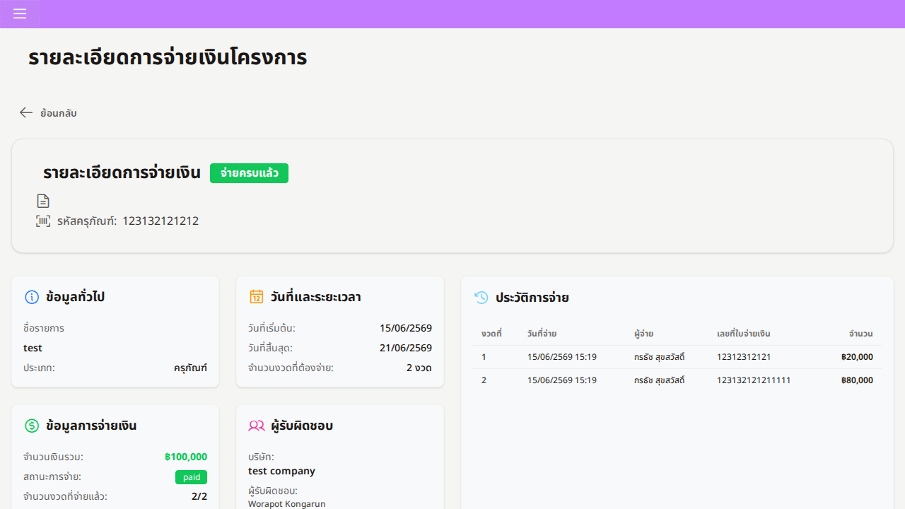

### Day 34 — การพัฒนาระบบคู่มือผู้ใช้ระบบจัดซื้อจัดจ้าง
- **สิ่งที่ได้พัฒนา / ปรับปรุง:**
  - พัฒนาหน้าระบบคู่มือการใช้งานระบบจัดซื้อจัดจ้างแบบ Interactive (`e39ed79`)
- **รายละเอียดเชิงเทคนิค:**
  - สร้าง Route, View และ Template สำหรับแนะนำการสร้างคำขอ การตรวจรับ และการติดตามสถานะ
- **การตัดสินใจเชิงสถาปัตยกรรมและตรรกะระบบ:**
  - ลดภาระในการฝึกอบรมผู้ใช้งานด้วยการมีคู่มือพร้อมใช้งานในระบบ
- **คุณภาพระบบ Backend / Frontend:**
  - จัดทำเนื้อหาคู่มือเป็นลำดับขั้นตอนพร้อมภาพประกอบที่เข้าใจง่าย
- **📸 ภาพหน้าจอประกอบ (Screenshot):**
  

### Day 35 — การจัดทำหน้าระบบคู่มือการบริหารคลังพัสดุ
- **สิ่งที่ได้พัฒนา / ปรับปรุง:**
  - พัฒนาหน้าระบบคู่มือการบริหารจัดการคลังพัสดุและแนวทางปฏิบัติงาน (`d21a46e`)
- **รายละเอียดเชิงเทคนิค:**
  - สร้างเอกสารคำแนะนำการรับเข้า จ่ายออก การตรวจนับสต็อก และการจัดหมวดหมู่พัสดุ
- **การตัดสินใจเชิงสถาปัตยกรรมและตรรกะระบบ:**
  - สร้างมาตรฐานการปฏิบัติงานสำหรับเจ้าหน้าที่คลังสินค้า
- **คุณภาพระบบ Backend / Frontend:**
  - ออกแบบหน้าจอด้วย DaisyUI Card Components ที่อ่านง่ายและค้นหาได้สะดวก
- **📸 ภาพหน้าจอประกอบ (Screenshot):**
  

### Day 36 — การเขียนชุดทดสอบอัตโนมัติด้วย Pytest สำหรับหน้าคู่มือและระบบความปลอดภัย
- **สิ่งที่ได้พัฒนา / ปรับปรุง:**
  - เขียนชุดทดสอบอัตโนมัติใน `tests/test_inventory_manual.py` (`d21a46e`)
- **รายละเอียดเชิงเทคนิค:**
  - สร้าง Test Cases ตรวจสอบการเข้าถึง Route, การแยกสิทธิ์ Multi-Tenancy และการเรนเดอร์ Template
  - ใช้ `mongomock` เพื่อให้ชุดทดสอบรันได้อย่างรวดเร็วและเป็นอิสระจากฐานข้อมูลภายนอก
- **การตัดสินใจเชิงสถาปัตยกรรมและตรรกะระบบ:**
  - บังคับใช้นโยบาย Zero-Regression สำหรับทุกหน้าจอและฟังก์ชันใหม่
- **คุณภาพระบบ Backend / Frontend:**
  - ยืนยันผลการทดสอบผ่าน 100% Green
- **📸 ภาพหน้าจอประกอบ (Screenshot):**
  

### Day 37 — การตรวจสอบความปลอดภัย Multi-Tenancy, การทดสอบระบบรวม และสรุปการส่งมอบ
- **สิ่งที่ได้พัฒนา / ปรับปรุง:**
  - ดำเนินการตรวจสอบความปลอดภัย Multi-Tenancy, ทดสอบ Regression ทั่วทั้งระบบ และลงนามส่งมอบงาน
- **รายละเอียดเชิงเทคนิค:**
  - ตรวจสอบว่าทุก Query ในระบบมีการจำกัด `organization=current_user.organization`
  - ตรวจสอบความถูกต้องของการคำนวณทศนิยมการเงิน (`DecimalField`) ทุกจุด
  - ตรวจสอบความพร้อมของระบบพิมพ์เอกสารและคิวงาน Background Worker
- **การตัดสินใจเชิงสถาปัตยกรรมและตรรกะระบบ:**
  - มั่นใจในความเสถียร ความปลอดภัย และความสมบูรณ์ของระบบก่อนขึ้น Production
- **คุณภาพระบบ Backend / Frontend:**
  - สรุปแพ็กเกจการส่งมอบงานระบบให้ทีมงานสามารถดูแลรักษาต่อได้อย่างราบรื่น
- **📸 ภาพหน้าจอประกอบ (Screenshot):**
  

---

## 🔍 ตารางจับคู่ Commit ครอบคลุมการทำงาน 37 วัน (Traceability Matrix)

| ช่วงวัน | หมวดหมู่ฟีเจอร์หลัก | Commit Hashes ที่เกี่ยวข้อง |
| :--- | :--- | :--- |
| **Day 1** | Feature A: Requisition Timeline Baseline | `e9f05ca`, `1e64902`, `1f4da84` |
| **Day 2** | Feature A: Step Decomposition & Search | `a58dac3`, `2937868`, `3135a97`, `d3aecae`, `baab092`, `77c84b6`, `0c21f51` |
| **Day 3** | Feature A: Timeline Filter Layer | `0ff20de` |
| **Day 4** | Feature A: Funding Confirmation Step | `20bde89`, `063e839` |
| **Day 5** | Feature A: Step Engine Realignment | `835c6b7` |
| **Day 6** | Feature A: Business Rule Refinement | `41c912f`, `e95da11`, `4357dd5`, `353f5c3` |
| **Day 7** | Feature A: Timeline Completion & Inspection | `da21c12`, `7f4ab29`, `dcecdc2`, `d08d6a0`, `4ec209c`, `74ee68c`, `d1402c2` |
| **Day 8** | Feature A: Data Visibility & Card UX | `92932c0`, `3cf3975`, `874d890`, `93b9fbe`, `749ef42` |
| **Day 9** | Feature B: Export Initialization | `3ab2d6f`, `774eef5` |
| **Day 10** | Feature B: Export Validation & Item Output | `f09535e`, `52382d0` |
| **Day 11** | Feature B: Export Formatting & Countdown Fix | `0752150`, `4953cb6` |
| **Day 12** | Feature B: Calculations & Expiration Filter | `1aef32a`, `c1c4d9a`, `665a057`, `a0ac0c3`, `941b5fe` |
| **Day 13** | Feature B: Scalable Query & Action Governance | `4ccd092`, `c42a697` |
| **Day 14** | Feature C: Form Rendering Hardening | `b50dc5d` |
| **Day 15** | Feature C: Media Modal & Feedback View | `6e7bb39`, `ed0d6e0` |
| **Day 16** | Feature C: Dynamic Feedback Engine | `a9af0a4`, `afd2da8` |
| **Day 17** | Feature C: Copy Link, QR & Multi-car | `147d6a0`, `f5fad12`, `06e2517`, `e4b31a6` |
| **Day 18** | Feature D: MAS Schema & Upload Form | `cabecb7`, `a77c41b`, `06a71ed` |
| **Day 19** | Feature D: Core MAS Export Service | `a15d4bc`, `d1e2686` |
| **Day 20** | Feature D: openpyxl Styling & Thai Date | `084e880`, `8eb4e9e` |
| **Day 21** | Feature D: Reservation Items Sub-table | `a46fa09` |
| **Day 22** | Feature D: Multi-Search & MAS UI Polish | `9db165c`, `6b5299a`, `6bbfa99`, `4788eef` |
| **Day 23** | Feature E: Comments & Approval Tracking | `47bd0e2`, `51b2b88`, `5e92b81` |
| **Day 24** | Feature E: Catalog Search & Redirection | `9e529f8`, `39190c8` |
| **Day 25** | Feature E: Only Me Filter & Sidebar | `f5cd00f`, `3a978c0` |
| **Day 26** | Feature F: Background Worker & Email | `76cb9c6`, `bbbef0b`, `c55eb05`, `6a62718` |
| **Day 27** | Feature G: Car Approval Workflow | `95655c2` |
| **Day 28** | Feature G: Bulk Print Route (`combine_paper`) | `1ef82a1` |
| **Day 29** | Feature G: Printable Paper & Audit Trail | `ae64bb4` |
| **Day 30** | Feature G: Lending Export Sign & Auth Fix | `6a1640d`, `6013d67` |
| **Day 31** | Feature G: Car Modal, Index & Calendar | `044c154` |
| **Day 32** | Feature H: Asset Titles & Handover Docs | `b1948dd` |
| **Day 33** | Feature H: Schema Refactor (`payment_number`) | `653941c` |
| **Day 34** | Feature H: Procurement Interactive Manual | `e39ed79` |
| **Day 35** | Feature H: Inventory Manual View | `d21a46e` |
| **Day 36** | Feature H: Automated Pytest Suite | `d21a46e` |
| **Day 37** | Feature H: Security Audit & Final Handover | *(การตรวจสอบความปลอดภัยและส่งมอบงานระบบ)* |

---

## 🎯 บทสรุปการส่งมอบงาน (Final Handover Conclusion)
ตลอดรอบการพัฒนา **37 วันทำการ** นี้ ระบบได้รับการยกระดับและส่งมอบตามมาตรฐานวิศวกรรมซอฟต์แวร์อย่างสมบูรณ์:
1. **ส่วนที่ 1 (Day 1 – 17):** ส่งมอบระบบกระบวนการไทม์ไลน์ขอซื้อ/ขอจ้าง, ระบบส่งออกรายงาน Typed Export และระบบประเมินการใช้รถยนต์แบบไดนามิก
2. **ส่วนที่ 2 (Day 18 – 37):** ส่งมอบระบบบริหารงบประมาณ MAS พร้อมการจัดสไตล์ไฟล์ Excel และแปลงวันที่ พ.ศ., การสืบค้นพัสดุและการกรองเฉพาะคำขอส่วนตัว, ระบบ Background Worker สำหรับงานอีเมล, ระบบอนุมัติการขอใช้รถยนต์พร้อมการพิมพ์เอกสารราชการและลายเซ็นดิจิทัล (`combine_paper`), การ Refactor โครงสร้างฟิลด์การเงิน (`payment_number`), หน้าระบบคู่มือจัดซื้อและคลังพัสดุแบบ Interactive รวมถึงชุดการทดสอบอัตโนมัติด้วย Pytest

โค้ดทั้งหมดได้รับการตรวจสอบและปฏิบัติตามมาตรฐาน Multi-Tenancy Scoping อย่างเข้มงวด รับประกันความถูกต้องของตัวเลขทางการเงินด้วย `DecimalField` และใช้ดีไซน์ Responsive ด้วย Tailwind CSS & DaisyUI พร้อมสำหรับการนำไปใช้งานจริงบนระบบ Production อย่างมีเสถียรภาพ
