# รายงานสรุปผลการส่งมอบงานและการพัฒนาโปรเจกต์ Kampan — saktanuthpeak (ฉบับละเอียด 38 วัน)

## 📌 ภาพรวมโปรเจกต์และขอบเขตงาน (Project Overview & Scope)

เอกสารฉบับนี้เป็นรายงานสรุปผลการปฏิบัติงานและการส่งมอบงาน (Work Handover Report) ของบัญชี **saktanuthpeak** บนโปรเจกต์ **Kampan (DIIS Inventory / ระบบพัสดุ–จัดซื้อ–ยานพาหนะ)** ครอบคลุมระยะเวลาการพัฒนา **38 วันทำการ × 6 ชั่วโมง = 228 ชั่วโมง** โดยเนื้อหางานทั้งหมดอ้างอิงจาก `git log` จริงของบัญชีนี้ (2025-07-31 → 2026-08-18) ตามที่สรุปไว้ใน [worklog_saktanuthpeak.md](worklog_saktanuthpeak.md) และจัดกลุ่มใหม่ให้เหลือ 38 วันตามเอกสารต้นทาง

ทุกวันมี **ภาพหน้าจอประกอบจริงจากระบบ** ที่แคปจากฐานข้อมูลพัฒนา (`kampandb`) ผ่านเบราว์เซอร์ Chrome ความละเอียด 1440×900 (scale 1.5) เก็บไว้ที่ `docs/images/handover_saktanuthpeak/` ตามข้อกำหนดใน [HANDOVER_SCREENSHOT_CAPTURE_GUIDE.md](HANDOVER_SCREENSHOT_CAPTURE_GUIDE.md)

### 🏛️ สรุปโมดูลหลักที่ส่งมอบ (9 ฟีเจอร์หลัก)

| ฟีเจอร์ | ชื่อกลุ่มงาน | ช่วงวัน | จำนวนวัน |
| :--- | :--- | :--- | :--- |
| **Feature A** | Procurement Catalog & Payment Foundation (ข้อมูลพัสดุจัดซื้อ, Excel Upload, การชำระเงิน) | Day 1 – 4 | 4 |
| **Feature B** | Requisition Workflow, Mail & Navigation (คำขอ, อีเมลแจ้งเตือน, เมนูระบบ) | Day 5 – 7 | 3 |
| **Feature C** | MAS Budget & Reservation System (ระบบงบประมาณ MAS และการจองงบ) | Day 8 – 10 | 3 |
| **Feature D** | Vehicle Lending & Upload UX (ใบเบิกรถ, Drag-and-drop Upload, Excel Refactor) | Day 11 – 13 | 3 |
| **Feature E** | Completion Flow, Car Tasks & Document Numbering (ขั้นตอนเสร็จสมบูรณ์, งานคืนรถ, เลขที่เอกสาร) | Day 14 – 18 | 5 |
| **Feature F** | Requisition Timeline Module (ไทม์ไลน์คำขอ, ตัวกรอง, สิทธิ์, การส่งออก) | Day 19 – 24 | 6 |
| **Feature G** | Car Feedback & Multi-Tenancy Enforcement (ระบบประเมินการใช้รถ, บังคับใช้หลายหน่วยงาน) | Day 25 – 30 | 6 |
| **Feature H** | Vehicle Permission UX, Roles & Security Hardening (สิทธิ์การใช้รถ, บทบาทผู้ใช้, ความปลอดภัย) | Day 31 – 35 | 5 |
| **Feature I** | Manuals, Organization Switching & Automated Tests (คู่มือระบบ, สลับหน่วยงาน, ชุดทดสอบ) | Day 36 – 38 | 3 |

---

# 📦 ส่วนที่ 1: รากฐานระบบจัดซื้อและคำขอ (Part 1: Day 1 – 10)

## Feature A: Procurement Catalog & Payment Foundation (Day 1 – 4)

### Day 1 — การควบคุมชนิดไฟล์อัปโหลดและการตรวจสอบข้อมูลในฟอร์มพัสดุ
- **สิ่งที่ได้พัฒนา / ปรับปรุง:**
  - จำกัดชนิดไฟล์ที่อัปโหลดได้ให้เป็น `.xlsx` เท่านั้นในหน้าจัดการรายการจัดซื้อ `[procurement/products]`
  - ปรับ checkbox ผู้รับผิดชอบและจัด styling ของฟอร์มให้อ่านง่ายขึ้น `[procurement/products]`
  - เพิ่มการตรวจสอบไฟล์รูปภาพและ error handling ในฟอร์มบันทึกรายการ `[procurement/products]`
- **รายละเอียดเชิงเทคนิค:**
  - เพิ่ม Validator ระดับ WTForms และตรวจนามสกุล/ชนิดไฟล์ก่อนส่งเข้าขั้นตอนอ่านไฟล์ Excel
  - ผูกการเลือกผู้รับผิดชอบแบบหลายรายการเข้ากับ checkbox เพื่อลดความผิดพลาดจากการพิมพ์ชื่อ
- **การตัดสินใจเชิงสถาปัตยกรรมและตรรกะระบบ:**
  - ใช้แนวทาง Validation-First: ปิดกั้นข้อมูลผิดรูปแบบที่ชั้นฟอร์ม ก่อนที่จะไปสร้างภาระให้ชั้นประมวลผลไฟล์และฐานข้อมูล
- **คุณภาพระบบ Backend / Frontend:**
  - ผู้ใช้ได้รับข้อความแจ้งเตือนที่ชัดเจนแทนการเกิด Exception กลางหน้าเว็บ
- **📸 ภาพหน้าจอประกอบ (Screenshot):**
  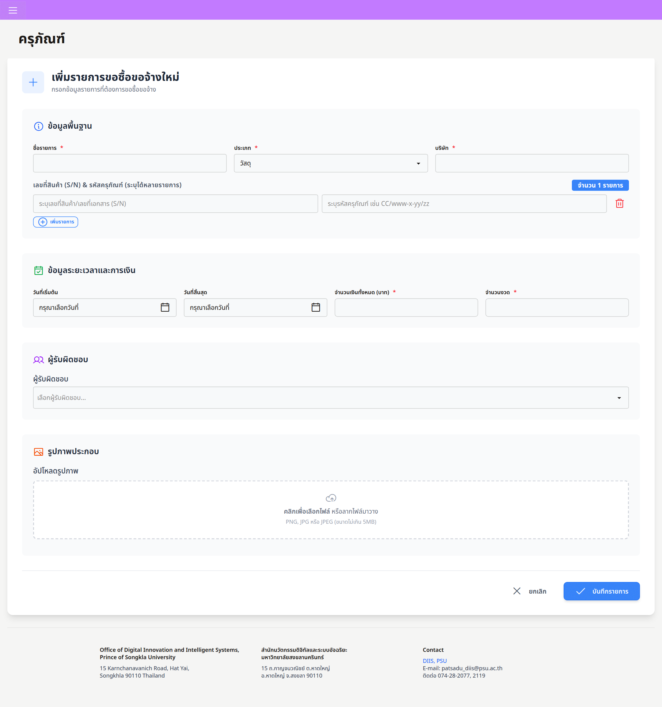

### Day 2 — ตัวกรองปีงบประมาณและการจัดรูปแบบตารางรายการจัดซื้อ
- **สิ่งที่ได้พัฒนา / ปรับปรุง:**
  - เพิ่มตัวกรองปีในหน้ารายการจัดซื้อ `[procurement]`
  - ปรับหัวตารางและรูปแบบการแสดงปี (พ.ศ.) ในมาโครตาราง `[procurement/macros]`
  - ปรับรูปแบบวันที่และการเรียงลำดับข้อมูลในตารางจัดซื้อ `[procurement/macros]`
  - เพิ่มการตรวจสอบและ error handling สำหรับยอดชำระเงินและเลขสินค้า `[procurement/payment]`
- **รายละเอียดเชิงเทคนิค:**
  - ย้ายการจัดรูปแบบวันที่/ปีไปอยู่ในมาโครกลาง เพื่อให้ทุกตารางแสดงผลรูปแบบเดียวกัน
  - เพิ่มการเรียงลำดับที่ระดับ Query แทนการเรียงในเทมเพลต ทำให้ทำงานร่วมกับ pagination ได้ถูกต้อง
- **การตัดสินใจเชิงสถาปัตยกรรมและตรรกะระบบ:**
  - กำหนดให้ "ปีงบประมาณ" เป็นมิติกรองหลักของงานจัดซื้อ เพื่อให้สอดคล้องกับรอบบัญชีขององค์กร
- **คุณภาพระบบ Backend / Frontend:**
  - ลดความคลาดเคลื่อนของการอ่านค่าเงินและวันที่ พร้อมสถิติสรุปสถานะการชำระเงินบนหัวหน้าจอ
- **📸 ภาพหน้าจอประกอบ (Screenshot):**
  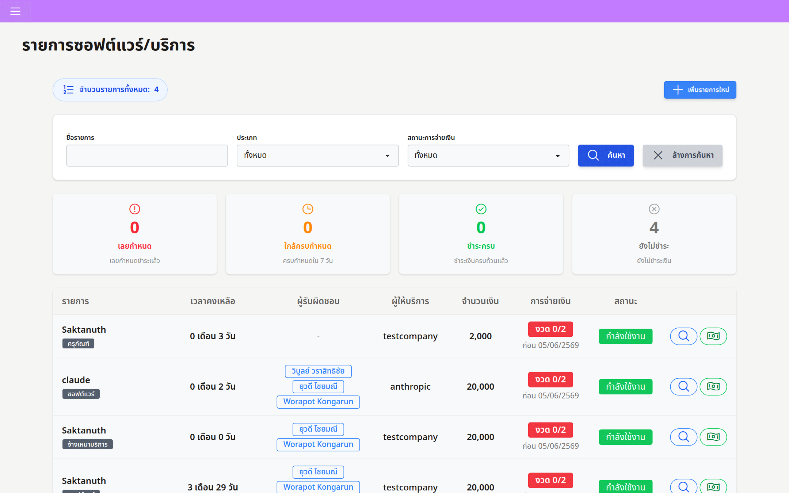

### Day 3 — ประวัติการชำระเงินและการล็อกยอดล่าสุดเป็น Read-only
- **สิ่งที่ได้พัฒนา / ปรับปรุง:**
  - แก้รูปแบบปีในตารางประวัติการชำระเงิน `[procurement/macros]`
  - ปรับหัวตารางส่วนประวัติการชำระเงิน `[procurement/payment]`
  - แก้ฟอร์มยอดล่าสุดให้เป็น readonly ในหน้าชำระเงิน `[procurement/payment]`
- **รายละเอียดเชิงเทคนิค:**
  - ใช้ Template Parameter ควบคุมสถานะ readonly ของฟิลด์ เพื่อป้องกันการแก้ยอดที่บันทึกแล้ว
  - แสดงยอดรวม/จำนวนงวดที่จ่ายแล้วจากการคำนวณฝั่ง Backend เพื่อไม่ให้ค่าบนจอเพี้ยนจากฐานข้อมูล
- **การตัดสินใจเชิงสถาปัตยกรรมและตรรกะระบบ:**
  - แยกเส้นทาง "บันทึกใหม่" ออกจาก "อ่านย้อนหลัง" อย่างชัดเจน เพื่อรักษาความถูกต้องของข้อมูลการเงิน
- **คุณภาพระบบ Backend / Frontend:**
  - ลดโอกาสเกิดข้อมูลการเงินไม่ตรงกัน (Data Drift) จากการแก้ย้อนหลังโดยไม่ตั้งใจ
- **📸 ภาพหน้าจอประกอบ (Screenshot):**
  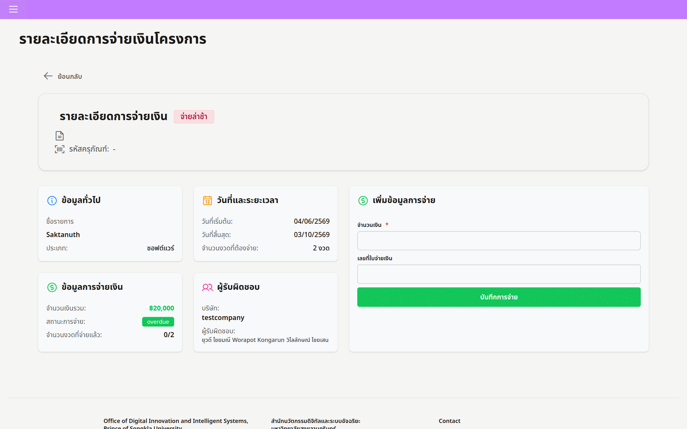

### Day 4 — ส่วนอัปโหลดไฟล์สำหรับงานจัดซื้อและระบบ MAS
- **สิ่งที่ได้พัฒนา / ปรับปรุง:**
  - เพิ่มส่วนอัปโหลดไฟล์สำหรับงานจัดซื้อและข้อมูล MAS `[procurement/upload_files, mas]`
- **รายละเอียดเชิงเทคนิค:**
  - แยกประเภทไฟล์ที่อัปโหลด (MA / MAS) ตามหมวดข้อมูล พร้อมมี Template ให้ดาวน์โหลดเป็นต้นแบบ
- **การตัดสินใจเชิงสถาปัตยกรรมและตรรกะระบบ:**
  - รวมช่องทางนำเข้าข้อมูลไว้ที่โมดูลเดียว (Upload Files) เพื่อให้การตรวจสอบและการขยายประเภทไฟล์ทำได้จากจุดเดียว
- **คุณภาพระบบ Backend / Frontend:**
  - ผู้ใช้เห็นรูปแบบไฟล์ที่ระบบต้องการก่อนอัปโหลด ลดจำนวนไฟล์ที่ต้องแก้ซ้ำ
- **📸 ภาพหน้าจอประกอบ (Screenshot):**
  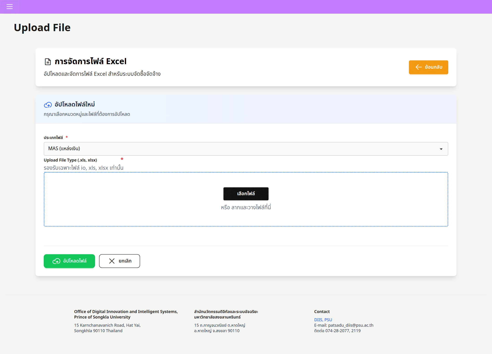

---

## Feature B: Requisition Workflow, Mail & Navigation (Day 5 – 7)

### Day 5 — ตัวกรองตามความคืบหน้าของคำขอ, การแบ่งหน้า และอีเมลถึงหัวหน้าผู้ให้บริการ
- **สิ่งที่ได้พัฒนา / ปรับปรุง:**
  - แก้ datatype ในคำขอ และแก้ชื่อฟิลด์ในไทม์ไลน์คำขอ `[procurement/requisitions]`
  - เพิ่มตัวกรองตาม progress และ choice ในหน้า requisition-progress พร้อมลบ view function ที่ไม่ใช้ `[procurement/requisitions]`
  - แก้ query และ pagination ให้ทำงานถูกต้องร่วมกับตัวกรอง `[procurement/requisitions]`
  - ส่งอีเมลแจ้งหัวหน้าผู้ให้บริการ (supervisor supplier) `[procurement/suppliers]`
- **รายละเอียดเชิงเทคนิค:**
  - ปรับ Query Layer ให้รับเงื่อนไขสถานะและแบ่งหน้าใน pipeline เดียว ลดการดึงข้อมูลเกินความจำเป็น
  - ลบ View ที่ไม่ถูกเรียกใช้ออกเพื่อลดพื้นผิวการดูแลรักษา (Maintenance Surface)
- **การตัดสินใจเชิงสถาปัตยกรรมและตรรกะระบบ:**
  - ใช้ progress เป็นแกนหลักในการมองคำขอ เพื่อให้เจ้าหน้าที่เห็นงานค้างตามขั้นตอนได้ทันที
- **คุณภาพระบบ Backend / Frontend:**
  - การแจ้งเตือนทางอีเมลทำให้ผู้อนุมัติรับรู้คำขอโดยไม่ต้องเข้ามาเช็คระบบเอง
- **📸 ภาพหน้าจอประกอบ (Screenshot):**
  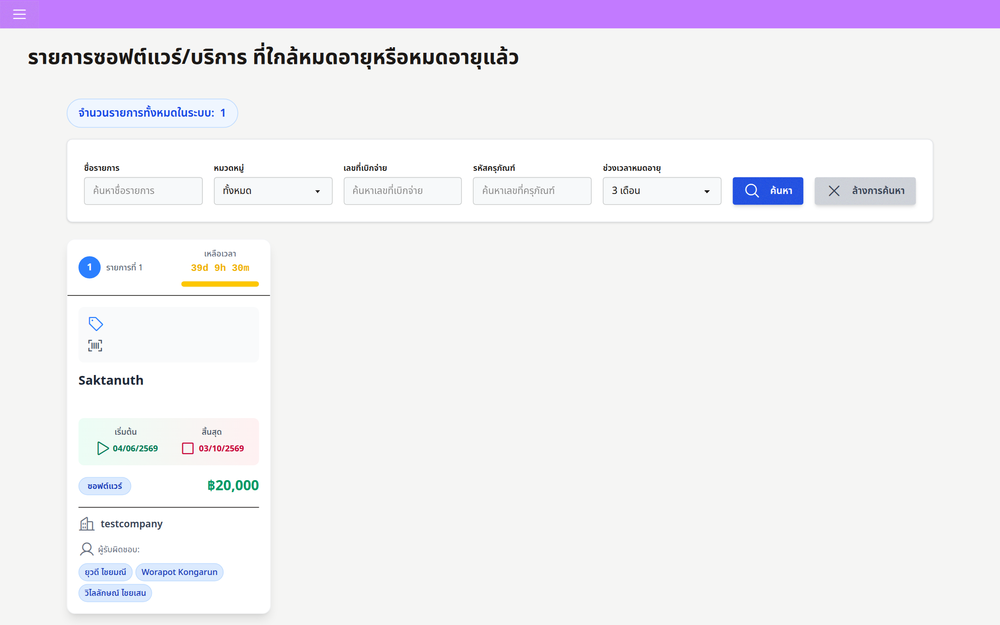

### Day 6 — อีเมลแจ้งยกเลิกคำขอและการกรองตามบทบาทหัวหน้า
- **สิ่งที่ได้พัฒนา / ปรับปรุง:**
  - ส่งอีเมลแจ้งยกเลิกคำขอให้ผู้ใช้ที่เกี่ยวข้อง `[procurement/requisitions]`
  - เพิ่มตัวกรองตามบทบาทหัวหน้า (head) `[procurement]`
- **รายละเอียดเชิงเทคนิค:**
  - ใช้ระบบ Email Template ที่จัดเก็บในฐานข้อมูล ทำให้แก้ข้อความแจ้งเตือนได้โดยไม่ต้องแก้โค้ด
  - กำหนดผู้รับอีเมลจากผู้เกี่ยวข้องของคำขอ ไม่ใช่ส่งกระจายทั้งหน่วยงาน
- **การตัดสินใจเชิงสถาปัตยกรรมและตรรกะระบบ:**
  - แยก "การมองเห็นข้อมูล" ตามบทบาท เพื่อให้หัวหน้าฝ่ายเห็นเฉพาะงานในความรับผิดชอบของตน
- **คุณภาพระบบ Backend / Frontend:**
  - ลดอีเมลรบกวนผู้ที่ไม่เกี่ยวข้อง และทำให้ประวัติการแจ้งเตือนตรวจสอบย้อนหลังได้
- **📸 ภาพหน้าจอประกอบ (Screenshot):**
  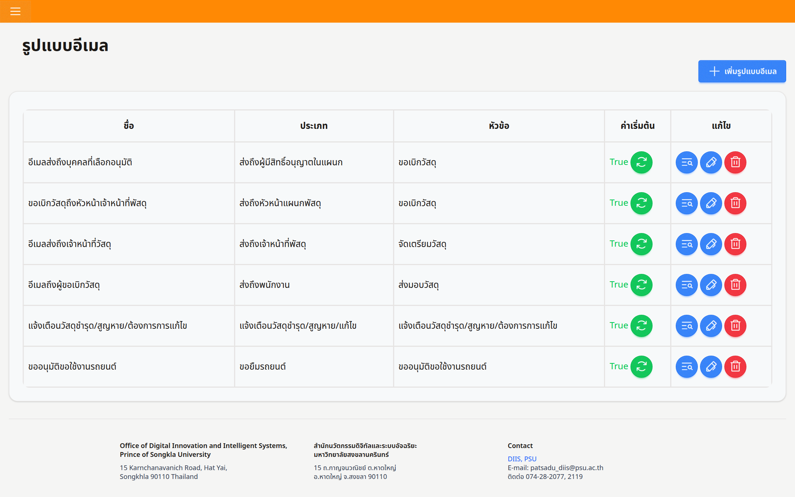

### Day 7 — การจัดระเบียบแถบเมนู Sidebar และเส้นทางยกเลิกคำขอ
- **สิ่งที่ได้พัฒนา / ปรับปรุง:**
  - แก้โครงสร้าง HTML ของ sidebar ให้จัดหมวดหมู่เมนูใหม่ `[procurement/base]`
  - สร้าง route เริ่มต้นสำหรับการยกเลิกคำขอ `[procurement/requisitions]`
- **รายละเอียดเชิงเทคนิค:**
  - จัดกลุ่มเมนูตามภารกิจ (อัปโหลดไฟล์ / ขอซื้อขอจ้าง / จัดการ MA / ระบบ MAS / คู่มือ) และแสดงตามมุมมองบทบาทที่เลือก
- **การตัดสินใจเชิงสถาปัตยกรรมและตรรกะระบบ:**
  - ให้ Sidebar เป็นตัวสะท้อนโครงสร้างการทำงานจริง (Role-based Navigation) แทนการเรียงตามลำดับที่พัฒนา
- **คุณภาพระบบ Backend / Frontend:**
  - ผู้ใช้เข้าถึงหน้าที่ต้องใช้งานได้ในจำนวนคลิกที่น้อยลง
- **📸 ภาพหน้าจอประกอบ (Screenshot):**
  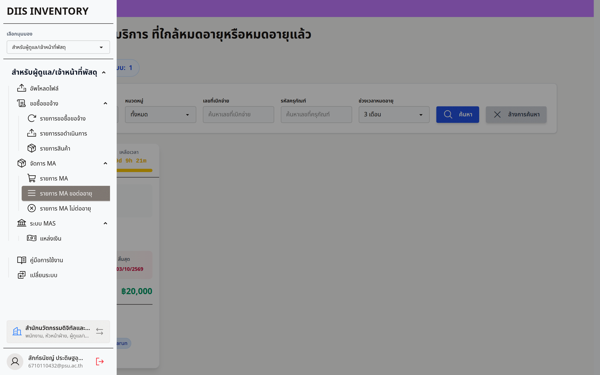

---

## Feature C: MAS Budget & Reservation System (Day 8 – 10)

### Day 8 — โครงสร้างฟอร์ม/ฟิลด์ระบบ MAS และการแบ่งหน้า
- **สิ่งที่ได้พัฒนา / ปรับปรุง:**
  - แก้ไขฟิลด์ ฟอร์ม และ UI ในระบบ MAS `[procurement/mas]`
  - เพิ่ม pagination ในหน้า MAS และหน้าคำขอต่ออายุ, เพิ่มสคริปต์ init requisitions `[procurement/mas, procurement/requisitions]`
  - แก้รายการฟอร์ม MA และปรับ pagination `[procurement/mas]`
  - เพิ่ม block title ให้หน้าสินค้า `[procurement/products]`
- **รายละเอียดเชิงเทคนิค:**
  - ปรับ Schema/ฟอร์มของ MAS ให้ครอบคลุมงบประมาณที่ขอจัดตั้ง งบคงเหลือ และงบที่จองได้
  - ใช้ค่าเงินแบบ `DecimalField` เพื่อความถูกต้องของการคำนวณงบประมาณ
- **การตัดสินใจเชิงสถาปัตยกรรมและตรรกะระบบ:**
  - ออกแบบ MAS ให้เป็น "แหล่งเงิน" ที่คำขอต่าง ๆ มาผูกจอง แทนการเก็บงบไว้ในคำขอแต่ละใบ
- **คุณภาพระบบ Backend / Frontend:**
  - หน้าจอรองรับข้อมูลจำนวนมากด้วย pagination โดยไม่กระทบเวลาโหลด
- **📸 ภาพหน้าจอประกอบ (Screenshot):**
  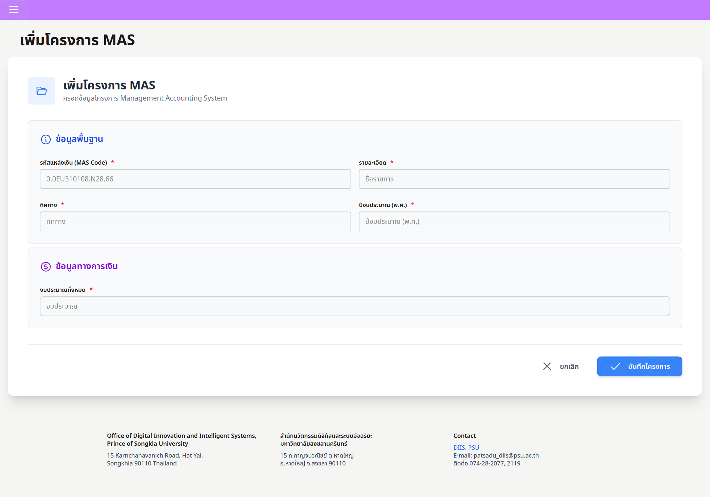

### Day 9 — ระบบการจองงบ MAS และการล็อกไม่ให้แก้เมื่อมอบหมายแล้ว
- **สิ่งที่ได้พัฒนา / ปรับปรุง:**
  - เพิ่มหน้าการจอง (reservation) ใน MAS และ flow การจองในหน้าแอดมิน `[procurement/mas]`
  - เพิ่มฟิลด์ `is_editable` เพื่อไม่ให้แก้ไขเมื่อมีการมอบหมายการจองแล้ว `[procurement/mas]`
  - Refactor ระบบ MAS ให้มีฟังก์ชันการทำงานสมบูรณ์ขึ้น `[procurement/mas]`
  - แก้ไขเทมเพลตอีเมลแจ้งยกเลิก `[procurement/requisitions]`
- **รายละเอียดเชิงเทคนิค:**
  - บันทึกการจองเป็นเอกสารแยก (reservation) ที่อ้างถึง MAS ทำให้ตรวจสอบยอดคงเหลือย้อนหลังได้
  - ใช้ธงสถานะควบคุมสิทธิ์แก้ไข แทนการตรวจเงื่อนไขกระจายในหลายเทมเพลต
- **การตัดสินใจเชิงสถาปัตยกรรมและตรรกะระบบ:**
  - ยึดหลัก Immutable-after-commit: เมื่อผูกงบกับงานจริงแล้ว ข้อมูลต้องคงที่เพื่อการตรวจสอบ
- **คุณภาพระบบ Backend / Frontend:**
  - ป้องกันงบประมาณติดลบหรือถูกจองซ้ำจากการแก้ไขพร้อมกัน
- **📸 ภาพหน้าจอประกอบ (Screenshot):**
  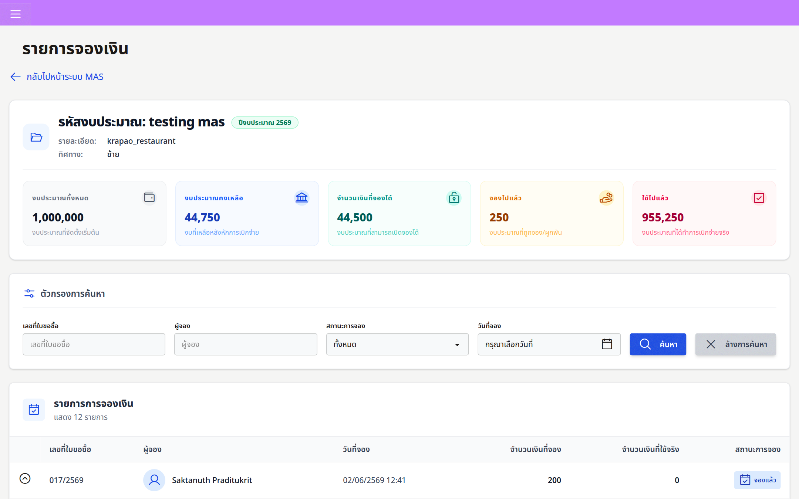

### Day 10 — Reusable Form Components และตารางยืนยันของหัวหน้าผู้ให้บริการ
- **สิ่งที่ได้พัฒนา / ปรับปรุง:**
  - Refactor components ของฟอร์มในงานจัดซื้อให้ใช้ร่วมกันได้ `[procurement]`
  - เพิ่มตารางยืนยันสำหรับหัวหน้าผู้ให้บริการ (supervisor supplier) `[procurement/suppliers]`
- **รายละเอียดเชิงเทคนิค:**
  - ย้ายชิ้นส่วนฟอร์มที่ใช้ซ้ำ (select, date, จำนวนเงิน) ไปเป็น Macro/Component กลาง
- **การตัดสินใจเชิงสถาปัตยกรรมและตรรกะระบบ:**
  - ลดการคัดลอกโค้ดเทมเพลต เพื่อให้การเปลี่ยนดีไซน์ครั้งเดียวมีผลทุกหน้า
- **คุณภาพระบบ Backend / Frontend:**
  - พฤติกรรมฟอร์มสอดคล้องกันทั้งระบบ และลดบั๊กจากเทมเพลตที่หลุดการแก้ไข
- **📸 ภาพหน้าจอประกอบ (Screenshot):**
  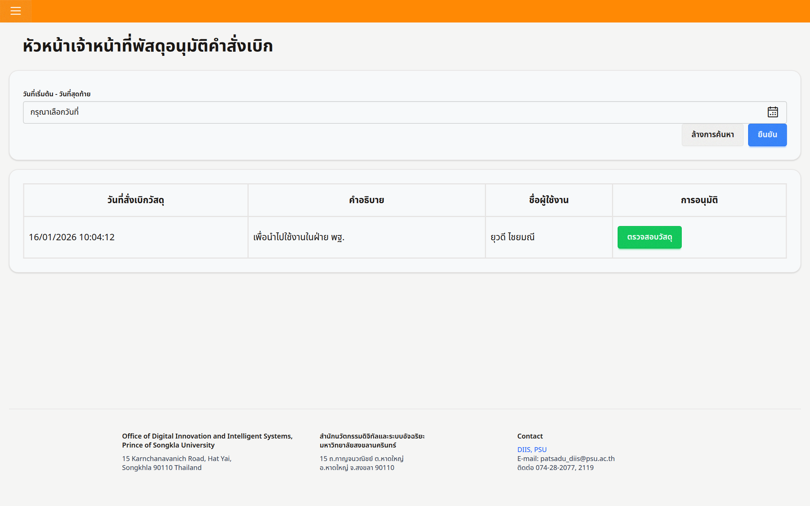

---

# 📦 ส่วนที่ 2: ระบบยานพาหนะ ไทม์ไลน์คำขอ และการยกระดับ UX (Part 2: Day 11 – 24)

## Feature D: Vehicle Lending & Upload UX (Day 11 – 13)

### Day 11 — ฟอร์มขอใช้รถ (รับส่งสนามบิน) และระบบอัปโหลดแบบ Drag-and-drop
- **สิ่งที่ได้พัฒนา / ปรับปรุง:**
  - เพิ่มฟอร์มรับส่งสนามบิน, แก้การแสดงผลตาราง และแก้บั๊กหน้า index ของใบเบิกรถ `[vehicle_lending/car_applications]`
  - เพิ่มระบบ drag-and-drop อัปโหลดไฟล์ พร้อม progress indicator และ toast แจ้งผล `[procurement/products]`
  - เพิ่ม modal แจ้งอัปโหลดสำเร็จ และปรับ layout/styling ของฟอร์มกรองและปุ่มในหน้าสินค้า `[procurement/products]`
  - ปรับปรุง progress เริ่มต้นของคำขอ `[procurement/requisitions]`
- **รายละเอียดเชิงเทคนิค:**
  - เพิ่มฟิลด์ประเภทการเดินทาง/รับส่งสนามบินในฟอร์มขอใช้รถ พร้อมเงื่อนไขการแสดงฟิลด์ตามประเภท
  - อัปโหลดไฟล์แบบ asynchronous พร้อมรายงานความคืบหน้าและผลลัพธ์กลับเป็น toast/modal
- **การตัดสินใจเชิงสถาปัตยกรรมและตรรกะระบบ:**
  - แยก "ประเภทการใช้รถ" เป็นข้อมูลโครงสร้าง เพื่อให้ต่อยอดรายงานและการมอบหมายคนขับได้
- **คุณภาพระบบ Backend / Frontend:**
  - ผู้ใช้เห็นสถานะการอัปโหลดแบบเรียลไทม์ ไม่ต้องเดาว่าระบบค้างหรือไม่
- **📸 ภาพหน้าจอประกอบ (Screenshot):**
  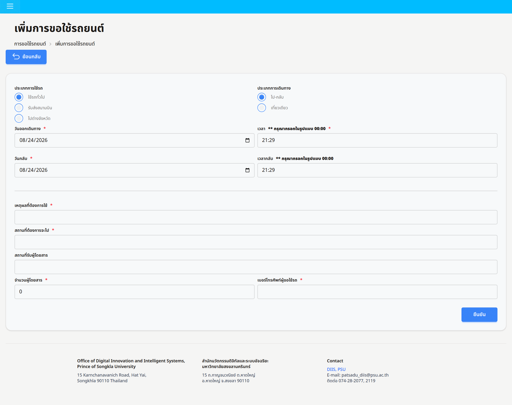

### Day 12 — Hash ในบันทึกไทม์ไลน์คำขอ และแถบค้นหา
- **สิ่งที่ได้พัฒนา / ปรับปรุง:**
  - เพิ่มฟังก์ชัน hash และฟิลด์ hashed ใน requisition timeline logs `[procurement/requisition_timeline]`
  - เพิ่มแถบค้นหาในไทม์ไลน์คำขอและหน้าคำขอต่ออายุ `[procurement/requisitions]`
  - ปรับดีไซน์หน้าคำขอ `[procurement/requisitions]`
- **รายละเอียดเชิงเทคนิค:**
  - คำนวณค่า hash ของเนื้อหา log เพื่อใช้ตรวจสอบความครบถ้วน/ไม่ถูกแก้ไขของบันทึกการดำเนินงาน
  - เพิ่มแถบค้นหาที่ผูกกับ Query Parameters ทำให้แชร์ลิงก์ผลการค้นหาได้
- **การตัดสินใจเชิงสถาปัตยกรรมและตรรกะระบบ:**
  - มองบันทึกไทม์ไลน์เป็น Audit Trail ที่ต้องพิสูจน์ความถูกต้องได้ ไม่ใช่เพียงข้อมูลแสดงผล
- **คุณภาพระบบ Backend / Frontend:**
  - เพิ่มความน่าเชื่อถือของประวัติการดำเนินงาน และค้นหาคำขอที่ต้องการได้เร็วขึ้น
- **📸 ภาพหน้าจอประกอบ (Screenshot):**
  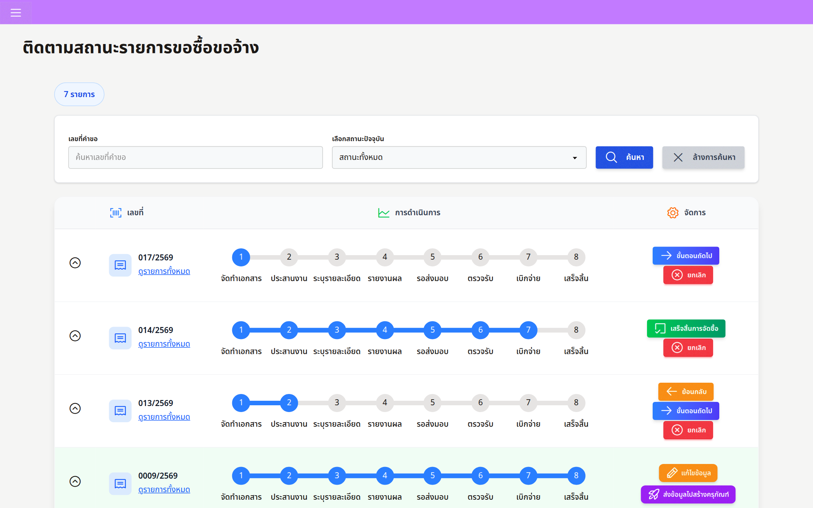

### Day 13 — Refactor การอัปโหลด Excel และข้อความแจ้งข้อผิดพลาด
- **สิ่งที่ได้พัฒนา / ปรับปรุง:**
  - Refactor การอัปโหลดไฟล์ MAS และงานจัดซื้อ `[procurement/upload_files, mas]`
  - เปลี่ยนฟังก์ชัน util สำหรับอ่านไฟล์ Excel และเพิ่ม error message `[procurement/upload_files]`
  - Hotfix ฟอร์มและแก้ไขข้อความในหน้าเว็บ `[procurement/macros]`
- **รายละเอียดเชิงเทคนิค:**
  - รวมตรรกะอ่าน Excel ไว้ที่ Utility เดียว และรายงานคอลัมน์ที่ขาดกลับเป็นรายการข้อความที่อ่านเข้าใจได้
  - บันทึกสถานะเอกสารที่อัปโหลด (สำเร็จ/ล้มเหลว) พร้อมข้อความผิดพลาดลงฐานข้อมูล
- **การตัดสินใจเชิงสถาปัตยกรรมและตรรกะระบบ:**
  - ให้ระบบ "อธิบายสาเหตุที่ไฟล์ไม่ผ่าน" แทนการปฏิเสธเงียบ ๆ เพื่อให้ผู้ใช้แก้ไฟล์ได้เอง
- **คุณภาพระบบ Backend / Frontend:**
  - ลดภาระผู้ดูแลระบบในการไล่หาสาเหตุไฟล์นำเข้าไม่สำเร็จ
- **📸 ภาพหน้าจอประกอบ (Screenshot):**
  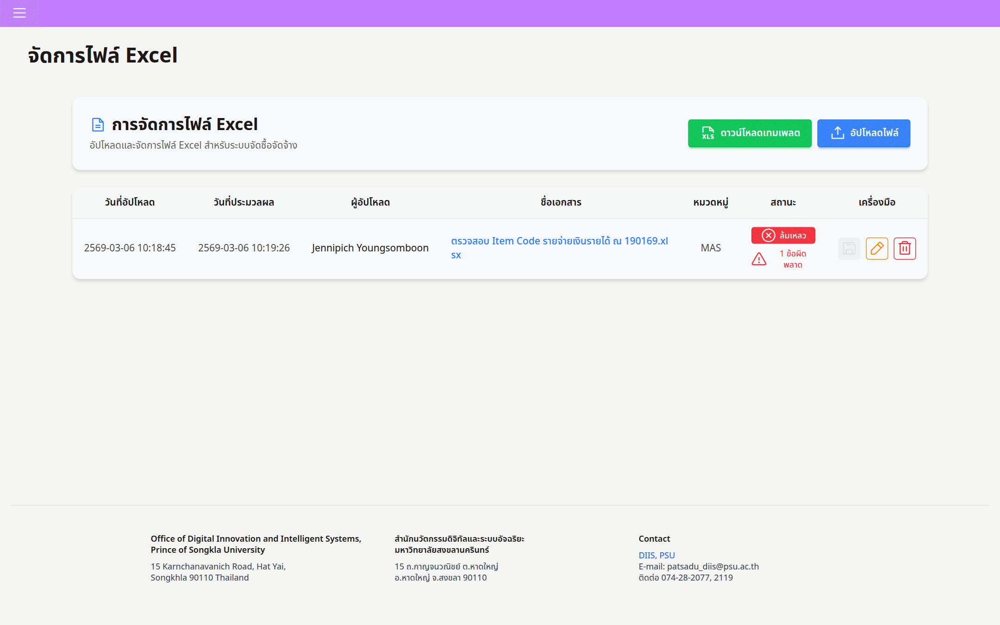

---

## Feature E: Completion Flow, Car Tasks & Document Numbering (Day 14 – 18)

### Day 14 — สถานะเสร็จสมบูรณ์บนปฏิทินการใช้รถ และผู้จัดการที่ทำหน้าที่แทน
- **สิ่งที่ได้พัฒนา / ปรับปรุง:**
  - เพิ่มสถานะ "เสร็จสิ้น" ในปฏิทินการใช้รถ `[vehicle_lending/car_applications]`
  - เพิ่ม modal เสร็จสมบูรณ์สำหรับคำขอจัดซื้อ และปรับ modal ให้ดูอย่างเดียวได้ `[procurement/requisitions, procurement/macros]`
  - เพิ่มฟังก์ชันเลือกผู้จัดการที่ทำหน้าที่แทน (acting manager) ในกระบวนการคำขอ `[procurement/requisitions]`
- **รายละเอียดเชิงเทคนิค:**
  - ผูกสีของ event บนปฏิทินกับสถานะคำขอ (อนุมัติ / รออนุมัติ / เสร็จสิ้น) เพื่ออ่านภาพรวมได้ในหน้าจอเดียว
  - เพิ่มตัวเลือกผู้อนุมัติแทนในกรณีผู้มีอำนาจไม่อยู่ โดยยังบันทึกผู้กระทำจริงไว้ใน log
- **การตัดสินใจเชิงสถาปัตยกรรมและตรรกะระบบ:**
  - รองรับกระบวนการจริงขององค์กร (การมอบอำนาจ) โดยไม่สูญเสียความสามารถในการตรวจสอบย้อนหลัง
- **คุณภาพระบบ Backend / Frontend:**
  - Modal โหมดอ่านอย่างเดียวช่วยป้องกันการแก้ไขข้อมูลที่ปิดงานแล้ว
- **📸 ภาพหน้าจอประกอบ (Screenshot):**
  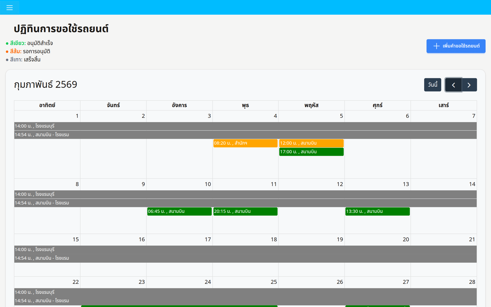

### Day 15 — บันทึกเลขไมล์และตัวกรองวันที่ในประวัติการใช้รถ
- **สิ่งที่ได้พัฒนา / ปรับปรุง:**
  - เพิ่มการบันทึกเลขไมล์ล่าสุดของรถและของใบเบิกรถ `[vehicle_lending]`
  - เพิ่มฟอร์มกรองวันที่ในหน้าประวัติการใช้รถ `[vehicle_lending/history_car_lending]`
  - เปลี่ยน modal เสร็จสมบูรณ์เป็นหน้ายื่นคำขอที่เสร็จสมบูรณ์ พร้อมส่วนรายการสินค้า `[procurement/macros]`
  - ปรับปรุงฟอร์มคำขอให้ใช้ shared fields และเลือกผู้ตอบกลับได้ `[procurement/requisitions]`
- **รายละเอียดเชิงเทคนิค:**
  - เก็บเลขไมล์ทั้งระดับรถ (ค่าล่าสุด) และระดับใบเบิก (ค่าตอนใช้งาน) เพื่อคำนวณระยะทางต่อทริปได้
  - ย้ายฟอร์มขนาดใหญ่จาก modal ไปเป็นหน้าเต็ม เพื่อรองรับรายการสินค้าหลายรายการ
- **การตัดสินใจเชิงสถาปัตยกรรมและตรรกะระบบ:**
  - เลือกใช้หน้าเต็มเมื่อฟอร์มมีข้อมูลหลายส่วน เพื่อลดปัญหา overflow และการกรอกข้อมูลไม่ครบ
- **คุณภาพระบบ Backend / Frontend:**
  - ประวัติการใช้รถกรองตามช่วงเวลาได้ ทำให้ทำรายงานรายเดือน/รายไตรมาสได้ง่าย
- **📸 ภาพหน้าจอประกอบ (Screenshot):**
  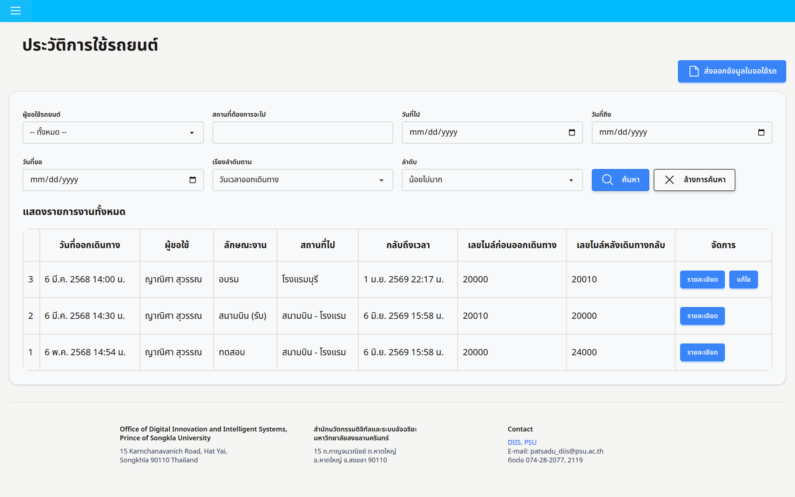

### Day 16 — การย้าย Route ไปใช้ Admin Prefix และการจัดการรอบปี TOR
- **สิ่งที่ได้พัฒนา / ปรับปรุง:**
  - แก้ URL ให้ใช้ admin prefix สำหรับ route ของ MAS และของงานจัดซื้อ `[procurement/mas, procurement]`
  - เพิ่มสถานะใน `tor_year` และเปลี่ยนการลบเป็นการตั้งสถานะ disactive `[procurement/tor_years]`
  - เพิ่มฟังก์ชัน copy/backup จาก TOR ที่มีอยู่ `[procurement/tor_years]`
  - ปรับฟิลด์ประเภทรับส่งสนามบินให้เป็น optional และแก้ label ภาษาไทยในตารางรถ `[vehicle_lending]`
- **รายละเอียดเชิงเทคนิค:**
  - จัดกลุ่ม endpoint ของงานผู้ดูแลไว้ใต้ `/admin/...` เพื่อให้การตรวจสิทธิ์และการอ่าน URL ชัดเจน
  - ใช้ Soft Delete (สถานะ disactive) แทนการลบจริง เพื่อรักษาการอ้างอิงของข้อมูลเดิม
- **การตัดสินใจเชิงสถาปัตยกรรมและตรรกะระบบ:**
  - ยึดหลัก "ไม่ลบข้อมูลที่มีการอ้างอิง" เพื่อรักษาความสมบูรณ์ของประวัติการจัดซื้อ
- **คุณภาพระบบ Backend / Frontend:**
  - การคัดลอก TOR เดิมช่วยลดเวลาเตรียมเอกสารรอบปีถัดไป
- **📸 ภาพหน้าจอประกอบ (Screenshot):**
  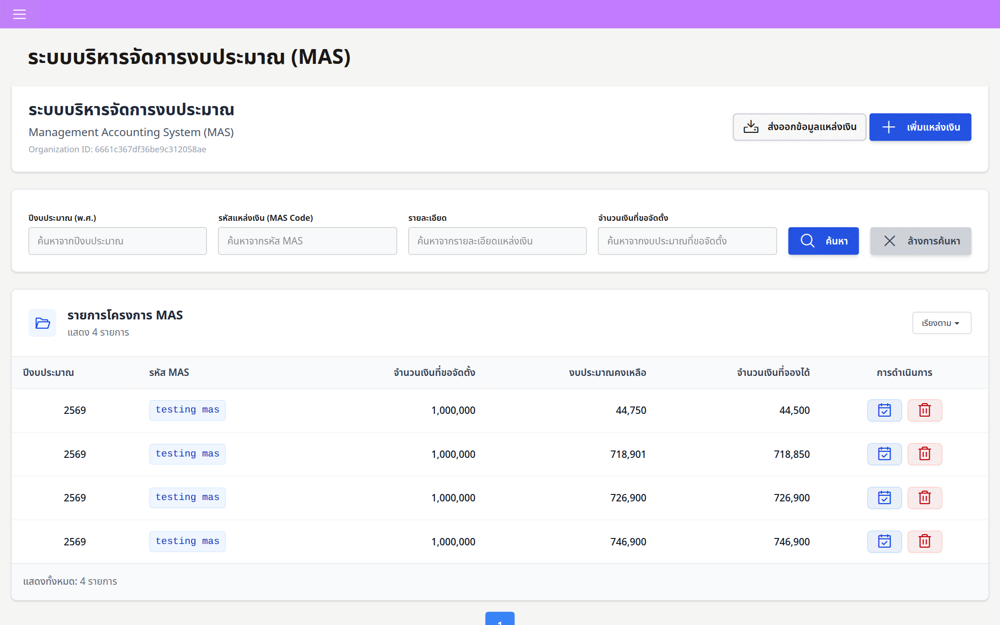

### Day 17 — โมดูลงานคืนรถ (Car Tasks) และการปรับเลขที่คำขอ
- **สิ่งที่ได้พัฒนา / ปรับปรุง:**
  - เพิ่มโมดูล car tasks สำหรับจัดการการคืนรถและบันทึกเลขไมล์ พร้อมปรับประวัติการใช้รถให้แสดงใบเบิกที่เสร็จสมบูรณ์ `[vehicle_lending/car_tasks]`
  - แก้การสร้างเลขคำขอถัดไป และปรับรูปแบบเลขคำขอ `[procurement/requisitions]`
  - แก้ URL ของ sidebar และ URL ในเทมเพลตอีเมล `[procurement, procurement/requisitions]`
  - แก้ parameter ของฟังก์ชันส่งอีเมลให้คนขับ `[vehicle_lending]`
- **รายละเอียดเชิงเทคนิค:**
  - สร้างหน้ารวมงานของคนขับ/เจ้าหน้าที่ (คืนรถ + บันทึกเลขไมล์) เพื่อปิด loop การใช้รถแต่ละครั้ง
  - แก้ตรรกะเลข running number ให้ต่อเนื่องและไม่ชนกันเมื่อมีคำขอพร้อมกัน
- **การตัดสินใจเชิงสถาปัตยกรรมและตรรกะระบบ:**
  - แยก "งานที่ต้องทำ" (task) ออกจาก "คำขอ" (application) เพื่อให้ผู้ปฏิบัติงานเห็นเฉพาะสิ่งที่ต้องลงมือ
- **คุณภาพระบบ Backend / Frontend:**
  - ลิงก์ในอีเมลชี้กลับมายังหน้าที่ถูกต้อง ลดการหลงทางของผู้ใช้
- **📸 ภาพหน้าจอประกอบ (Screenshot):**
  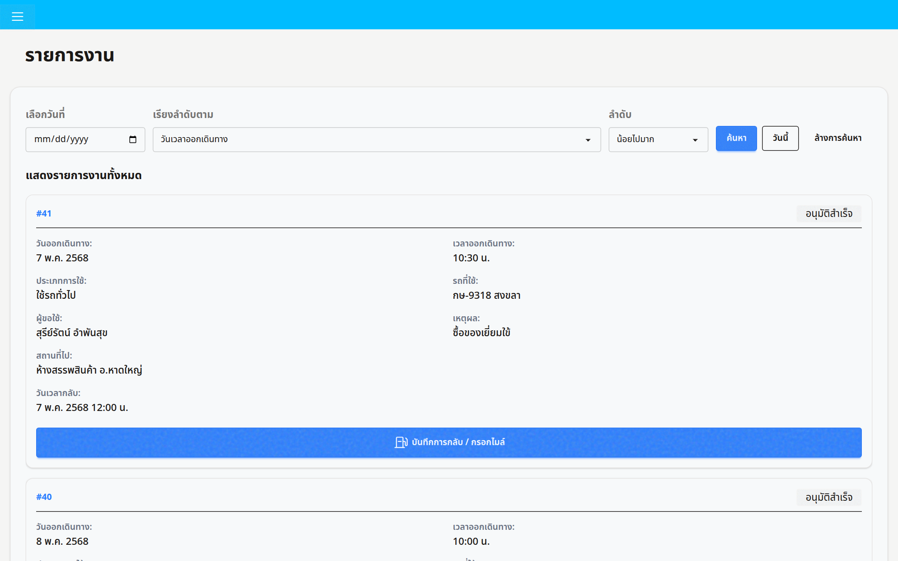

### Day 18 — หน้ายื่นคำขอที่เสร็จสมบูรณ์และเลขที่เอกสารแบบ Running Number
- **สิ่งที่ได้พัฒนา / ปรับปรุง:**
  - เพิ่มฟังก์ชันหน้าฟอร์มที่เสร็จสมบูรณ์ และระบบเลข running number `[procurement/requisition_timeline]`
  - เพิ่ม `hide_label` ใน macro ฟอร์ม และปรับ UI ตารางรายการของคำขอ `[procurement/requisition_timeline]`
- **รายละเอียดเชิงเทคนิค:**
  - รวมข้อมูลทุกขั้นตอนของคำขอมาแสดงในหน้าสรุปเดียว พร้อมออกเลขที่เอกสารเมื่อยื่นสมบูรณ์
- **การตัดสินใจเชิงสถาปัตยกรรมและตรรกะระบบ:**
  - ให้ "เอกสารที่ยื่นสมบูรณ์" เป็น Artifact ที่ตรึงข้อมูลไว้ ใช้อ้างอิงกับหน่วยงานภายนอกได้
- **คุณภาพระบบ Backend / Frontend:**
  - ลดการกรอกข้อมูลซ้ำจากขั้นตอนก่อนหน้า และได้เลขเอกสารที่เป็นระบบ
- **📸 ภาพหน้าจอประกอบ (Screenshot):**
  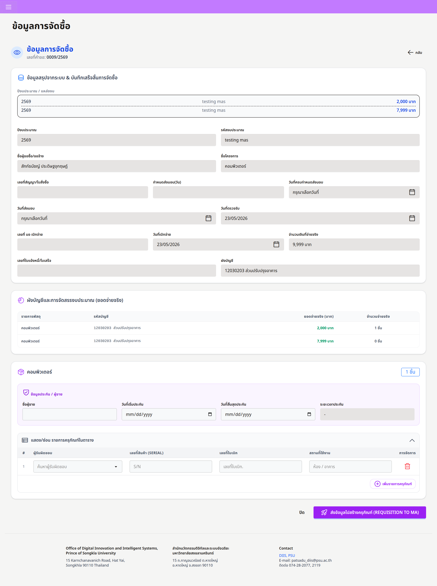

---

## Feature F: Requisition Timeline Module (Day 19 – 24)

### Day 19 — Reusable Components ของฟอร์มคำขอและการค้นหา
- **สิ่งที่ได้พัฒนา / ปรับปรุง:**
  - Refactor ฟอร์มค้นหาคำขอให้ใช้ components ร่วมกัน `[procurement/requisitions]`
  - Refactor UI หน้าสินค้าในงานจัดซื้อและ select field components `[procurement/products]`
  - เพิ่มตัวกรองคำขอในหน้า index และหน้าคำขอต่ออายุ `[procurement/requisitions]`
  - เริ่มต้นชุด agent/skill definitions และเอกสารอ้างอิงสำหรับ workflow ออกแบบ/พัฒนา `[dev-tooling/skills]`
- **รายละเอียดเชิงเทคนิค:**
  - แยก select/date/number field เป็น component ที่รับ config ได้ ทำให้ฟอร์มใหม่ประกอบได้เร็ว
- **การตัดสินใจเชิงสถาปัตยกรรมและตรรกะระบบ:**
  - ลงทุนกับ Component Library ภายในก่อนขยายจำนวนหน้าจอ เพื่อคุมต้นทุนการดูแลระยะยาว
- **คุณภาพระบบ Backend / Frontend:**
  - ฟอร์มขนาดใหญ่ยังคงอ่านง่ายและมีพฤติกรรมสอดคล้องกันทุกส่วน
- **📸 ภาพหน้าจอประกอบ (Screenshot):**
  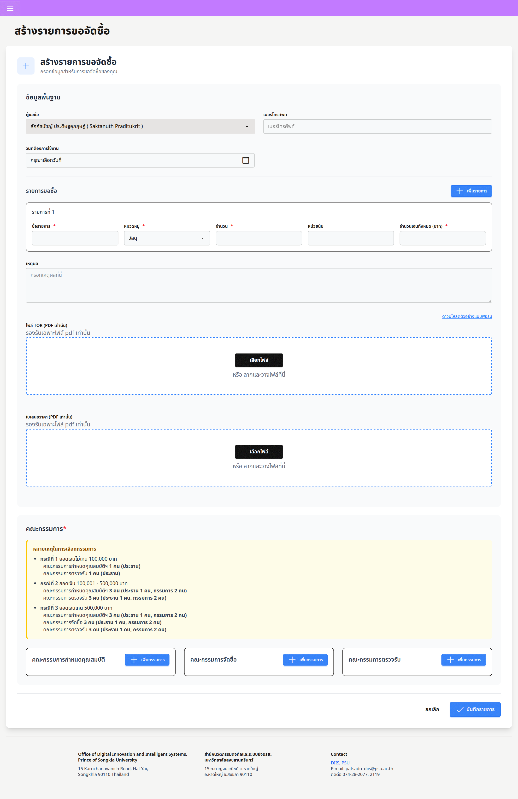

### Day 20 — ปุ่มยกเลิกคำขอ, WTForms และ Modal แสดงเหตุผล
- **สิ่งที่ได้พัฒนา / ปรับปรุง:**
  - เพิ่มปุ่มยกเลิกคำขอ และ modal แสดงเหตุผลใน progress ของคำขอ `[procurement/requisitions]`
  - เปลี่ยนมาใช้ WTForms แทนการอ่านค่าจาก `request.form` โดยตรง `[procurement]`
  - เพิ่มการตรวจสอบค่าตอนสร้างงานจัดซื้อ และแก้ดีไซน์ปุ่มในตาราง TOR years `[procurement, procurement/tor_years]`
  - สร้างฟอร์มกรองไทม์ไลน์คำขอ `[procurement/requisition_timeline]`
- **รายละเอียดเชิงเทคนิค:**
  - ใช้ WTForms เป็นชั้นตรวจสอบ/แปลงชนิดข้อมูลเดียว ลดโค้ดตรวจค่าที่กระจายอยู่ใน view
  - เก็บเหตุผลการยกเลิกไว้กับ progress เพื่อให้ผู้เกี่ยวข้องเห็นที่มาของการเปลี่ยนสถานะ
- **การตัดสินใจเชิงสถาปัตยกรรมและตรรกะระบบ:**
  - บังคับให้ทุก State Transition ที่ย้อนกลับไม่ได้ ต้องมีเหตุผลกำกับ
- **คุณภาพระบบ Backend / Frontend:**
  - ลดข้อมูลผิดรูปแบบเข้าฐานข้อมูล และเพิ่มความโปร่งใสของการยกเลิกงาน
- **📸 ภาพหน้าจอประกอบ (Screenshot):**
  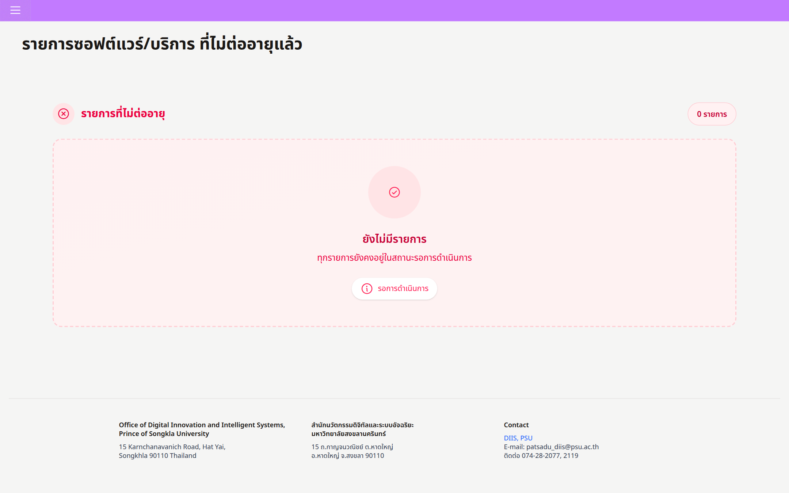

### Day 21 — Refactor Step Engine ของไทม์ไลน์คำขอ
- **สิ่งที่ได้พัฒนา / ปรับปรุง:**
  - Refactor UI และ logic ของไทม์ไลน์คำขอให้รองรับขั้นตอนงานจัดซื้อรูปแบบใหม่ `[procurement/requisition_timeline]`
- **รายละเอียดเชิงเทคนิค:**
  - ปรับโครงสร้างการส่งข้อมูลของแต่ละขั้นตอน (metadata + ฟอร์มเฉพาะขั้น) ให้เพิ่มขั้นตอนใหม่ได้โดยไม่แก้ทุกไฟล์
- **การตัดสินใจเชิงสถาปัตยกรรมและตรรกะระบบ:**
  - เลือกโมเดลความคืบหน้าแบบรวมศูนย์ (Centralized Progression Model) แทนเงื่อนไข if แยกรายขั้นตอน
- **คุณภาพระบบ Backend / Frontend:**
  - เพิ่มขั้นตอนใหม่ในอนาคตทำได้เร็วขึ้น และลดโอกาสสถานะไม่สอดคล้องกัน
- **📸 ภาพหน้าจอประกอบ (Screenshot):**
  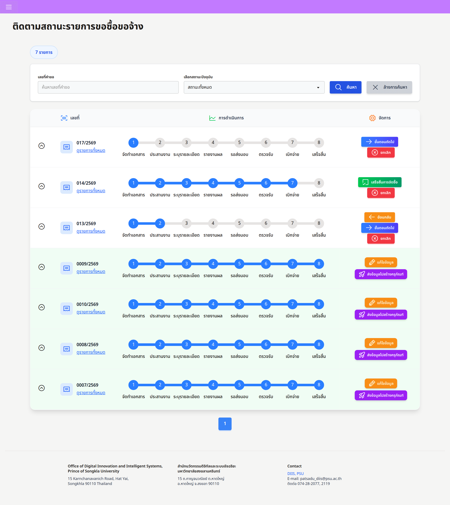

### Day 22 — ขั้นตอนระบุรายละเอียดและการเลือก MA หลายรายการ
- **สิ่งที่ได้พัฒนา / ปรับปรุง:**
  - เพิ่มโมดูลไทม์ไลน์คำขอ พร้อมระบบค้นหาและแสดงผล `[procurement/requisition_timeline]`
  - เพิ่มการเลือก MA หลายรายการสำหรับการยืนยันของแอดมิน `[procurement/mas]`
  - แก้สิทธิ์การเข้าถึงใน MA `[procurement/mas]`
- **รายละเอียดเชิงเทคนิค:**
  - ขั้นตอน `details_specified` แยกฟอร์มและเทมเพลตของตัวเอง เพื่อรับข้อมูลรายละเอียด/แหล่งเงินโดยเฉพาะ
  - รองรับการผูกหลาย MA ต่อการยืนยันครั้งเดียว พร้อมตรวจสิทธิ์ผู้ทำรายการ
- **การตัดสินใจเชิงสถาปัตยกรรมและตรรกะระบบ:**
  - แยกเทมเพลตตามบริบทของขั้นตอน ลดความซับซ้อนของเงื่อนไขเรนเดอร์ในไฟล์เดียว
- **คุณภาพระบบ Backend / Frontend:**
  - ผู้ดูแลจัดการหลายรายการได้ในครั้งเดียว ลดจำนวนขั้นตอนซ้ำ
- **📸 ภาพหน้าจอประกอบ (Screenshot):**
  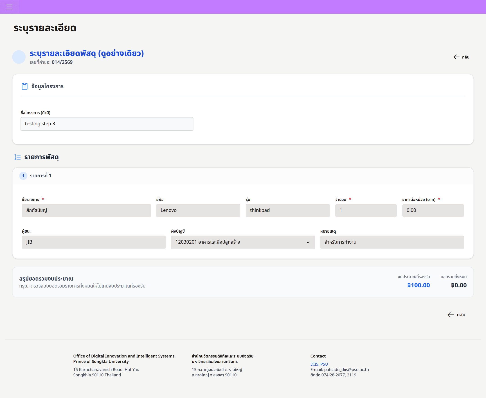

### Day 23 — วันที่สร้าง, การคำนวณระยะเวลาประกัน และ Flash Card
- **สิ่งที่ได้พัฒนา / ปรับปรุง:**
  - เพิ่มวันที่สร้างในตารางไทม์ไลน์คำขอ และปรับ logic การกรอง `[procurement/requisition_timeline]`
  - เพิ่มการคำนวณระยะเวลาประกันในโมเดล และปรับ UI ตารางไทม์ไลน์ `[procurement/requisition_timeline]`
  - เพิ่ม flash card แจ้งผลการทำงานในเว็บ `[web/base]`
  - เพิ่มฟิลด์ requisition ในการจอง (reservation) `[procurement/mas]`
- **รายละเอียดเชิงเทคนิค:**
  - คำนวณระยะเวลาประกันในชั้น Model แล้วส่งค่าไปแสดงผล เพื่อไม่ให้ตรรกะธุรกิจอยู่ในเทมเพลต
  - ผูก reservation กลับไปหาคำขอต้นทาง ทำให้ตรวจสอบได้ว่างบถูกจองด้วยคำขอใบใด
- **การตัดสินใจเชิงสถาปัตยกรรมและตรรกะระบบ:**
  - แยกการคำนวณทางธุรกิจออกจากชั้นแสดงผล เพื่อให้ทดสอบได้และนำไปใช้ซ้ำได้
- **คุณภาพระบบ Backend / Frontend:**
  - ตารางแสดงข้อมูลที่ผู้ใช้ต้องใช้ตัดสินใจ (วันที่สร้าง/ระยะประกัน) ครบในที่เดียว
- **📸 ภาพหน้าจอประกอบ (Screenshot):**
  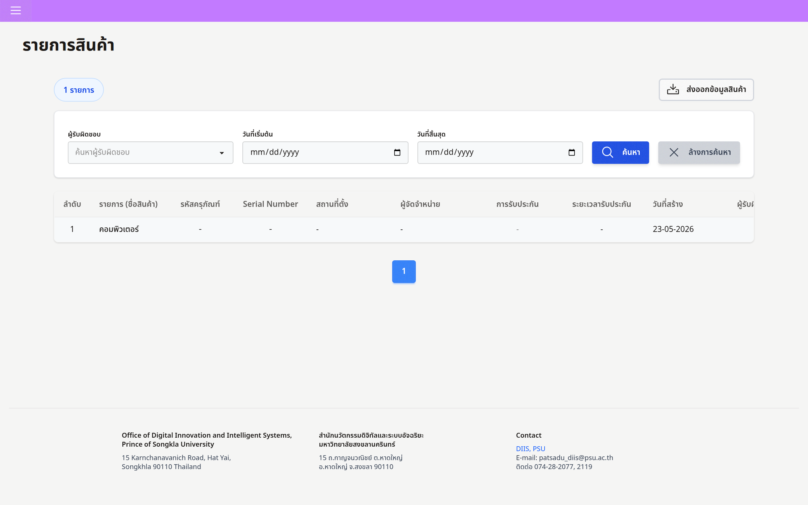

### Day 24 — Pagination, ตัวกรองผู้ใช้/คำขอหมดอายุ และการส่งออกข้อมูล
- **สิ่งที่ได้พัฒนา / ปรับปรุง:**
  - เพิ่ม pagination และตัวกรองผู้ใช้ในไทม์ไลน์คำขอ `[procurement/requisition_timeline]`
  - เพิ่มตัวกรองคำขอที่หมดอายุ และจำกัดปุ่ม action ตามสถานะ `[procurement/requisitions]`
  - เพิ่ม modal ยืนยันก่อนบันทึกการชำระเงิน `[procurement/payment]`
  - แก้การกำหนด role ผู้จัดงาน (organizer) `[accounts/organizations]`
  - แก้ชื่อคอลัมน์ "ปังบประมาณ" เป็น "ปีงบประมาณ" และแก้ title `[procurement/upload_files]`
- **รายละเอียดเชิงเทคนิค:**
  - ส่งออกข้อมูลผ่าน modal ที่รับช่วงวันที่ พร้อมเก็บประวัติไฟล์ที่ส่งออกไว้ให้ดาวน์โหลดซ้ำ
  - ซ่อน/ปิดปุ่ม action ที่ไม่ควรกดได้ตามสถานะ เพื่อป้องกันการทำรายการผิดขั้นตอน
- **การตัดสินใจเชิงสถาปัตยกรรมและตรรกะระบบ:**
  - ใช้ Modal ยืนยันเป็นด่านสุดท้ายของงานที่มีผลทางการเงิน/ข้อมูลปริมาณมาก
- **คุณภาพระบบ Backend / Frontend:**
  - ลดความเสี่ยง Request Timeout ตอนส่งออกข้อมูลใหญ่ และลดการกดผิดของผู้ใช้
- **📸 ภาพหน้าจอประกอบ (Screenshot):**
  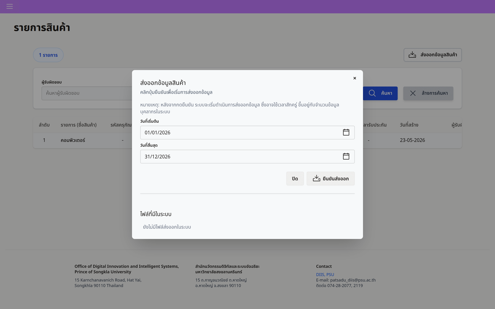

---

# 📦 ส่วนที่ 3: ระบบประเมินการใช้รถ ความปลอดภัย และการส่งมอบ (Part 3: Day 25 – 38)

## Feature G: Car Feedback & Multi-Tenancy Enforcement (Day 25 – 30)

### Day 25 — หน้าจัดการแบบประเมินการใช้รถ (Car Feedback)
- **สิ่งที่ได้พัฒนา / ปรับปรุง:**
  - สร้างหน้าฟีดแบ็กการใช้รถ (car feedback page) `[vehicle_lending/car_feedback]`
  - เพิ่มฟิลด์ company ในรายการคำขอ และเพิ่ม gitignore `[procurement/requisitions]`
  - แก้ตาราง MA `[procurement/mas]`
- **รายละเอียดเชิงเทคนิค:**
  - สร้างโมเดลแบบประเมิน (template) ที่ผูกกับรถหลายคัน และแยกคำตอบ (response) เป็นเอกสารของตัวเอง
- **การตัดสินใจเชิงสถาปัตยกรรมและตรรกะระบบ:**
  - ออกแบบแบบประเมินให้เป็นข้อมูล (Data-driven Form) ไม่ใช่ฟอร์มตายตัวในโค้ด
- **คุณภาพระบบ Backend / Frontend:**
  - ผู้ดูแลสร้าง/แก้แบบประเมินได้เองโดยไม่ต้องรอรอบ deploy
- **📸 ภาพหน้าจอประกอบ (Screenshot):**
  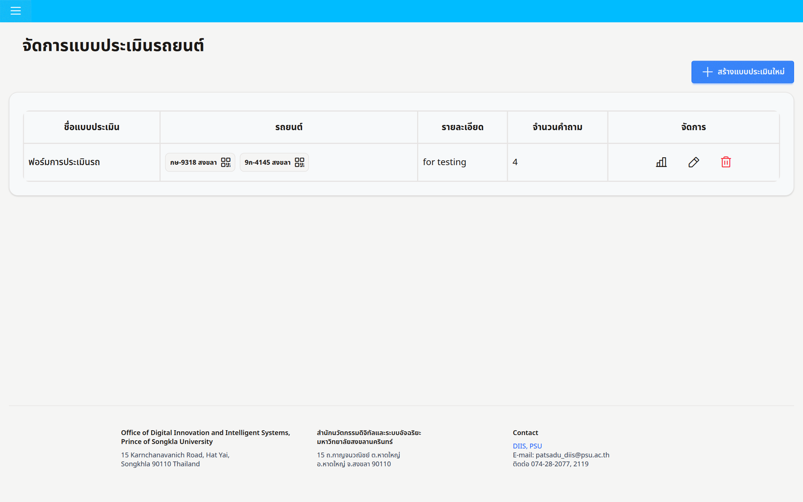

### Day 26 — การจัดระเบียบเครื่องมือพัฒนา (Dev Tooling Cleanup)
- **สิ่งที่ได้พัฒนา / ปรับปรุง:**
  - Cleanup: ลบชุด skills ที่ไม่ได้ใช้งานออกจากโปรเจกต์ `[dev-tooling/skills]`
- **รายละเอียดเชิงเทคนิค:**
  - ถอด submodule/สคริปต์ช่วยพัฒนาที่ไม่ถูกเรียกใช้ออกจาก repository เพื่อลดขนาดและความสับสน
- **การตัดสินใจเชิงสถาปัตยกรรมและตรรกะระบบ:**
  - แยกเครื่องมือช่วยพัฒนาออกจากโค้ดที่ deploy จริง เก็บไว้เฉพาะสิ่งที่ทีมใช้งานจริง
- **คุณภาพระบบ Backend / Frontend:**
  - โครงสร้าง repository สะอาดขึ้น ผู้เข้าร่วมใหม่หาไฟล์ที่เกี่ยวข้องได้เร็วขึ้น
- **📸 ภาพหน้าจอประกอบ (Screenshot):**
  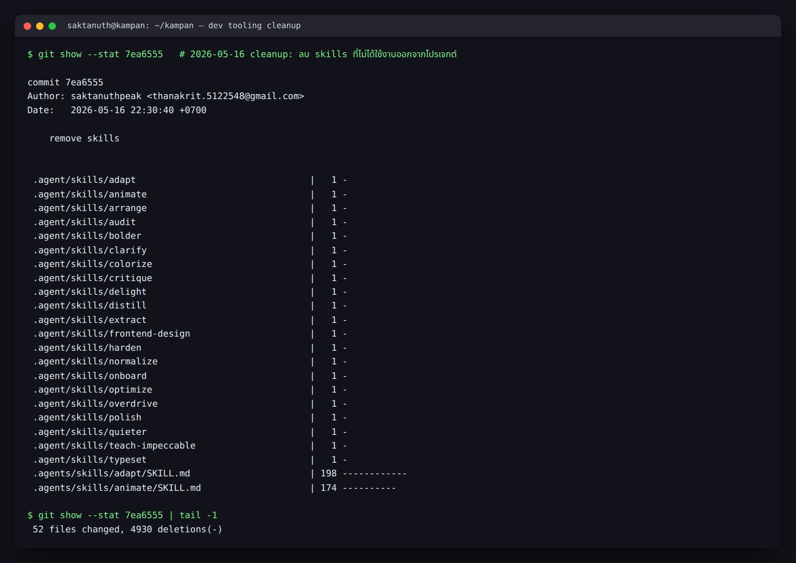

### Day 27 — รูปภาพแบบ Modal, ฟอนต์และเลย์เอาต์ของเอกสารคำขอ
- **สิ่งที่ได้พัฒนา / ปรับปรุง:**
  - Refactor การแสดงรูปภาพ และเพิ่ม modal แสดงรูปแบบเต็ม `[procurement/item_orders]`
  - แก้ฟอนต์และ layout ในเอกสารคำขอ `[procurement/requisitions]`
  - แก้ max length ของฟิลด์ และแก้ overflow ของ dropdown ในหน้ายื่นคำขอที่เสร็จสมบูรณ์ `[procurement/requisitions]`
- **รายละเอียดเชิงเทคนิค:**
  - จัดฟอนต์และระยะบรรทัดของเอกสารให้ใกล้เคียงแบบฟอร์มราชการ เพื่อพิมพ์ออกใช้งานได้ทันที
- **การตัดสินใจเชิงสถาปัตยกรรมและตรรกะระบบ:**
  - แยกเทมเพลตสำหรับ "หน้าจอ" และ "เอกสารพิมพ์" ให้ชัดเจน เพราะข้อจำกัดการจัดหน้าต่างกัน
- **คุณภาพระบบ Backend / Frontend:**
  - เอกสารที่พิมพ์ออกมามีรูปแบบสม่ำเสมอ ไม่มีข้อความตกหล่นหรือทะลุขอบกระดาษ
- **📸 ภาพหน้าจอประกอบ (Screenshot):**
  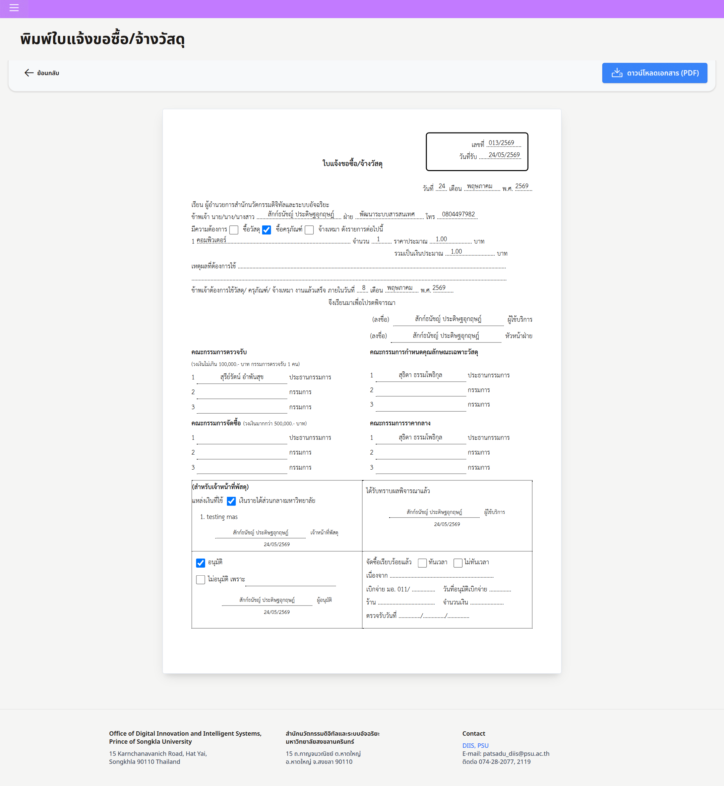

### Day 28 — Modal รายละเอียดกิจกรรมบนปฏิทินแบบโหลดจากเซิร์ฟเวอร์
- **สิ่งที่ได้พัฒนา / ปรับปรุง:**
  - เปลี่ยน alert เป็น modal แสดงรายละเอียดกิจกรรมใบเบิกรถ `[vehicle_lending/car_applications]`
  - โหลด modal event แบบไดนามิกผ่าน server-side component ในปฏิทิน `[vehicle_lending/car_applications]`
  - เพิ่มผู้ใช้ที่เป็นคนขับในใบเบิกรถ และแก้การส่งอีเมลให้เฉพาะคนขับที่ถูกมอบหมาย `[vehicle_lending/car_applications]`
  - แก้ปัญหา overflow และเอา required ออกจากขั้นตอน 7 ของฟอร์ม `[procurement/requisitions]`
- **รายละเอียดเชิงเทคนิค:**
  - เมื่อคลิก event ปฏิทิน ระบบเรียก endpoint เพื่อดึง HTML ของ modal มาแสดง ลดข้อมูลที่ต้องฝังในหน้าแรก
  - ส่งอีเมลเฉพาะคนขับที่ถูกมอบหมาย ป้องกันการแจ้งเตือนกระจายเกินจำเป็น
- **การตัดสินใจเชิงสถาปัตยกรรมและตรรกะระบบ:**
  - ใช้ Server-rendered Fragment (htmx/fetch) เพื่อให้ modal ใช้เทมเพลตชุดเดียวกับหน้าอื่น
- **คุณภาพระบบ Backend / Frontend:**
  - หน้าปฏิทินโหลดเร็วขึ้น และรายละเอียดคำขออ่านง่ายกว่าการใช้ alert
- **📸 ภาพหน้าจอประกอบ (Screenshot):**
  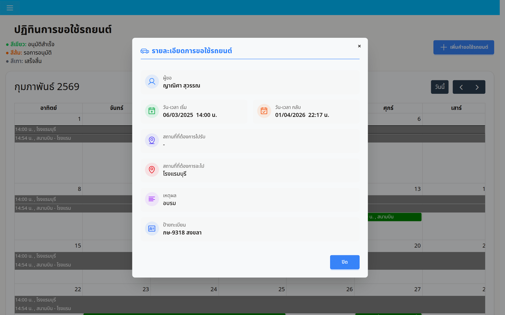

### Day 29 — การบังคับใช้ Multi-Tenancy ในระบบงานจัดซื้อ
- **สิ่งที่ได้พัฒนา / ปรับปรุง:**
  - บังคับใช้ multi-tenant ในระบบงานจัดซื้อ `[procurement]`
  - เพิ่มการผูกองค์กรตอนสร้าง/แก้ไขข้อมูลจัดซื้อ `[procurement]`
  - แก้ layout ปุ่มและหน้า supplier/ปฏิทิน `[procurement/suppliers, dashboard]`
- **รายละเอียดเชิงเทคนิค:**
  - ทุก Query ของงานจัดซื้อถูก scope ด้วยหน่วยงานที่กำลังดูอยู่ (`g.organization`) และตรวจสมาชิกภาพก่อนเข้าถึง
  - เขียนฟิลด์ organization ลงเอกสารตอนสร้าง เพื่อให้การกรองภายหลังเชื่อถือได้
- **การตัดสินใจเชิงสถาปัตยกรรมและตรรกะระบบ:**
  - ยึดหลัก Deny-by-default: ถ้าไม่ระบุ/ไม่เป็นสมาชิกหน่วยงาน จะไม่เห็นข้อมูลเลย
- **คุณภาพระบบ Backend / Frontend:**
  - ปิดช่องข้อมูลข้ามหน่วยงาน (Cross-tenant Leakage) ซึ่งเป็นความเสี่ยงระดับสูงสุดของระบบหลายหน่วยงาน
- **📸 ภาพหน้าจอประกอบ (Screenshot):**
  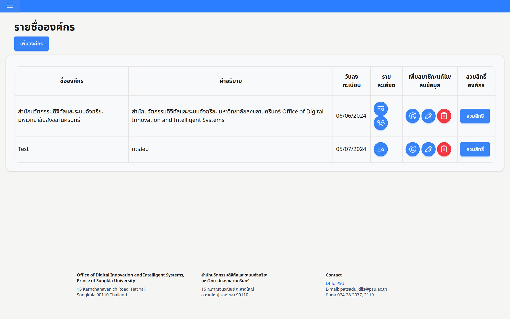

### Day 30 — ระบบประเมินการใช้รถแบบไดนามิกและแดชบอร์ดสรุปผล
- **สิ่งที่ได้พัฒนา / ปรับปรุง:**
  - พัฒนาระบบฟีดแบ็กการใช้รถแบบไดนามิก รองรับคำถามหลายประเภทและ component render ฟอร์ม `[vehicle_lending/car_feedback]`
  - แก้หัวข้อ dashboard และปุ่ม copy link / QR สำหรับทดสอบบน staging `[vehicle_lending/car_feedback]`
  - เพิ่มฟิลด์องค์กรใน `RequisitionTimelineLogs` และแก้ไขฟิลด์ role `[procurement/requisition_timeline]`
  - เพิ่มตัวเลือกกองทุนในหน้าแอดมิน และปรับปรุงหน้าคำขอต่ออายุที่ยื่นแล้วพร้อมรายละเอียดกองทุน `[procurement/requisitions]`
  - เพิ่ม backend สำหรับตัวติดตาม progress คำขอ `[procurement/requisitions]`
- **รายละเอียดเชิงเทคนิค:**
  - รองรับคำถามหลายชนิด (ให้คะแนนดาว / ใช่-ไม่ใช่ / ข้อความ) และสรุปสถิติแยกตามชนิดคำถาม
  - สรุปผลตามรถและตามทริป พร้อมกรองข้อมูลได้จากหน้าแดชบอร์ดเดียว
- **การตัดสินใจเชิงสถาปัตยกรรมและตรรกะระบบ:**
  - เก็บคำตอบให้ผูกกับ "ทริป" และ "รถ" เพื่อให้วิเคราะห์คุณภาพบริการได้ละเอียดกว่าค่าเฉลี่ยรวม
- **คุณภาพระบบ Backend / Frontend:**
  - ผู้บริหารเห็นคะแนนเฉลี่ย การกระจายคะแนน และความเห็นปลายเปิดในหน้าจอเดียว
- **📸 ภาพหน้าจอประกอบ (Screenshot):**
  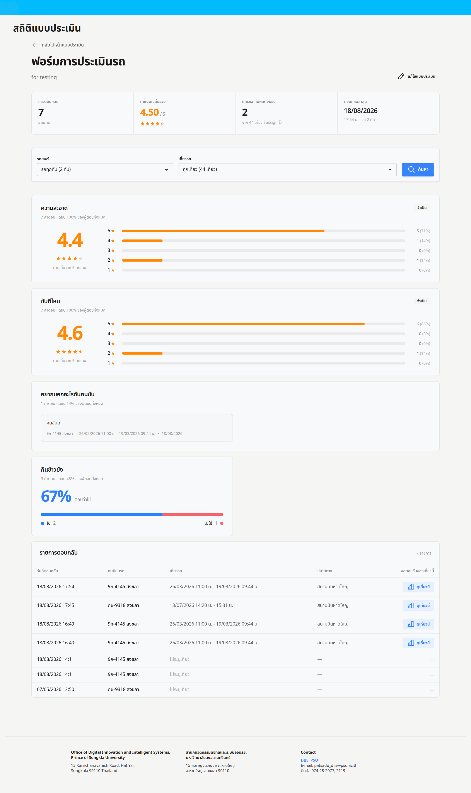

---

## Feature H: Vehicle Permission UX, Roles & Security Hardening (Day 31 – 35)

### Day 31 — Refactor UI ตารางรถและฟิลด์การเงินแบบ Decimal
- **สิ่งที่ได้พัฒนา / ปรับปรุง:**
  - Refactor การแสดงผล UI ของตารางรถ `[vehicle_lending/car_permissions]`
  - แก้ layout หน้ายื่นคำขอที่เสร็จสมบูรณ์ และเปลี่ยน float เป็น decimal field `[procurement/requisitions]`
  - เพิ่มฟิลด์ผู้ชนะการเสนอราคาและยอดรวมในไทม์ไลน์คำขอ `[procurement/requisition_timeline]`
  - ลบ timestamp ที่ไม่จำเป็นในขั้นตอนการอนุมัติของผู้จัดการ `[procurement/requisitions]`
  - เพิ่มคำสั่ง AI (GEMINI) และคู่มือ multi-agent workflow `[project-config]`
- **รายละเอียดเชิงเทคนิค:**
  - เปลี่ยนชนิดข้อมูลจำนวนเงินเป็น `DecimalField` เพื่อกำจัดความคลาดเคลื่อนจากเลขทศนิยมลอยตัว
- **การตัดสินใจเชิงสถาปัตยกรรมและตรรกะระบบ:**
  - ตัวเลขทางการเงินต้องแม่นยำระดับสตางค์ จึงไม่ใช้ float ในทุกเส้นทางการคำนวณ
- **คุณภาพระบบ Backend / Frontend:**
  - ยอดรวมในเอกสารและบนหน้าจอตรงกันทุกจุด
- **📸 ภาพหน้าจอประกอบ (Screenshot):**
  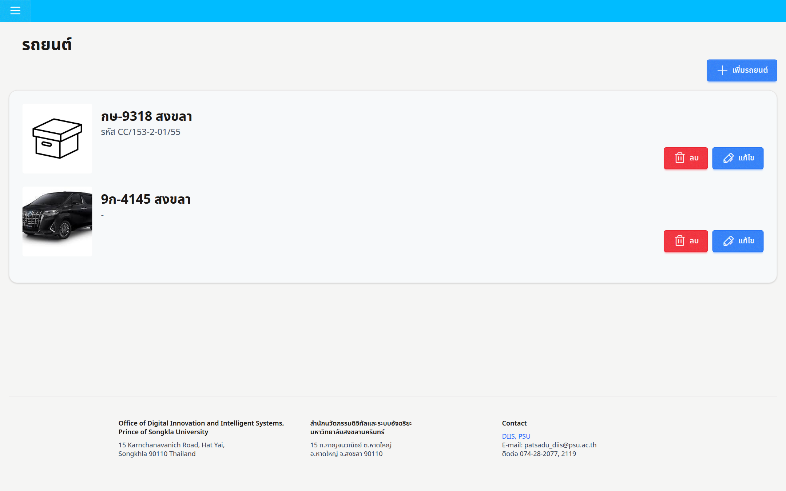

### Day 32 — ฟอร์มแก้ไขบทบาทผู้ใช้และสิทธิ์การเข้าถึงไทม์ไลน์
- **สิ่งที่ได้พัฒนา / ปรับปรุง:**
  - ปรับฟอร์มแก้ไข role ผู้ใช้ให้ดึงข้อมูลเดิมมาเติมอัตโนมัติ `[accounts/roles]`
  - แก้สิทธิ์การเข้าถึงไทม์ไลน์คำขอ `[procurement/requisition_timeline]`
  - แก้การแสดงผลหน้าผู้จัดการและหน้าคำขอต่ออายุ `[procurement/requisitions]`
  - เพิ่ม multiple select สำหรับเลือกรถในฟอร์ม `[vehicle_lending/car_feedback]`
  - เพิ่มการตรวจสอบ progress ก่อนอัปเดตค่าใหม่ `[procurement/requisitions]`
- **รายละเอียดเชิงเทคนิค:**
  - เติมค่าเดิมของบทบาท/สังกัดในฟอร์มแก้ไข ป้องกันการบันทึกทับด้วยค่าว่าง
  - ตรวจสถานะ progress ปัจจุบันก่อนเขียนค่าใหม่ เพื่อกันการข้ามขั้นตอน
- **การตัดสินใจเชิงสถาปัตยกรรมและตรรกะระบบ:**
  - ตรวจสิทธิ์ตามบทบาท "ในหน่วยงานที่กำลังดู" ไม่ใช่บทบาทใดก็ได้ที่ผู้ใช้เคยมี
- **คุณภาพระบบ Backend / Frontend:**
  - ลดอุบัติเหตุการตั้งค่าสิทธิ์ผิด ซึ่งกระทบทั้งการมองเห็นข้อมูลและการอนุมัติ
- **📸 ภาพหน้าจอประกอบ (Screenshot):**
  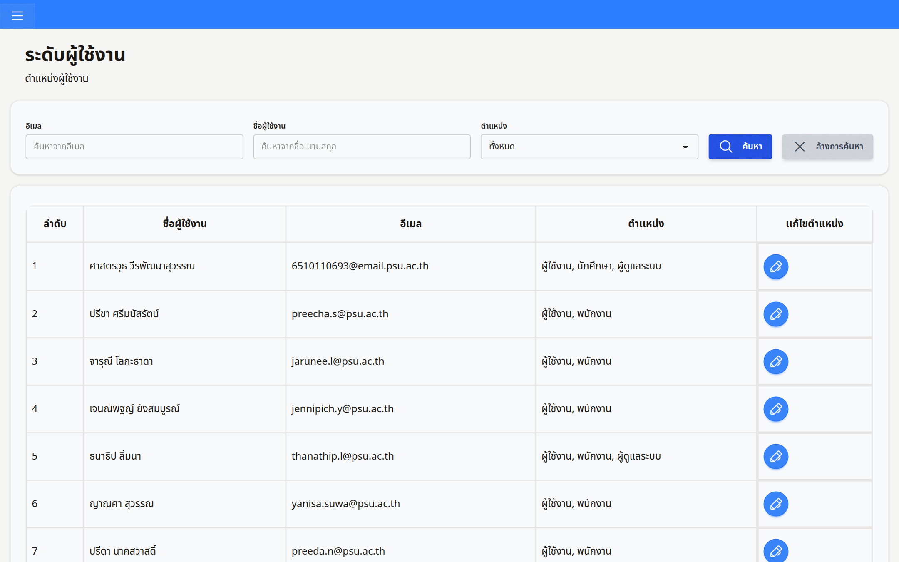

### Day 33 — การมอบหมายคนขับ/รถ และ Modal ยืนยันแบบใหม่
- **สิ่งที่ได้พัฒนา / ปรับปรุง:**
  - ออกแบบ modal ยืนยันใหม่ และแก้การมอบหมายคนขับ/รถในหน้าแอดมิน `[vehicle_lending/car_permissions]`
  - เพิ่มรายละเอียดใน modal ปฏิทิน และเพิ่มวันที่สร้างในตารางสิทธิ์การใช้รถ `[vehicle_lending/car_permissions]`
  - แก้ปุ่มพิมพ์ให้ disable เมื่อไม่มีใบเบิกรถ และเพิ่มสิทธิ์ role หัวหน้าในไทม์ไลน์คำขอ `[vehicle_lending/car_applications, procurement/requisition_timeline]`
  - ปรับการจัดการสถานะคำขอ และเพิ่มการแสดงคำขอที่รอหัวหน้าอนุมัติ `[procurement/requisitions]`
  - เพิ่มหน้า preview เอกสารต่ออายุ และแก้ฟอนต์ `[procurement/requisitions]`
- **รายละเอียดเชิงเทคนิค:**
  - รวมการอนุมัติ + มอบหมายรถ/คนขับไว้ใน modal เดียว ลดจำนวนรอบการทำงานของผู้ดูแล
- **การตัดสินใจเชิงสถาปัตยกรรมและตรรกะระบบ:**
  - ปิดการกระทำที่ไม่มีข้อมูลรองรับ (เช่น พิมพ์เอกสารที่ยังไม่มีใบเบิก) ที่ระดับ UI และ Backend
- **คุณภาพระบบ Backend / Frontend:**
  - ผู้ดูแลเห็นข้อมูลครบก่อนกดอนุมัติ ลดการอนุมัติผิดคัน/ผิดคนขับ
- **📸 ภาพหน้าจอประกอบ (Screenshot):**
  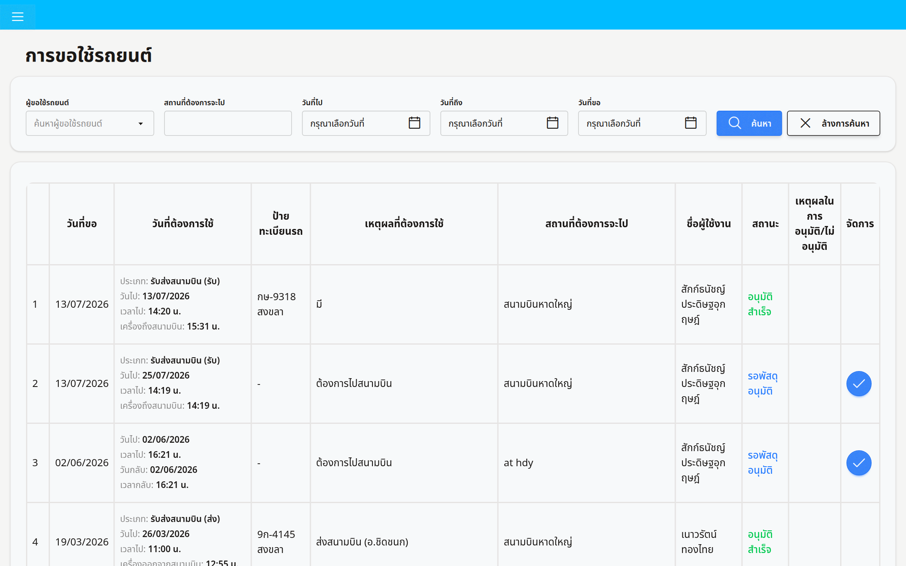

### Day 34 — Refactor ฟอร์ม/เทมเพลตงานจัดซื้อ และการแสดงข้อมูลบนปฏิทิน
- **สิ่งที่ได้พัฒนา / ปรับปรุง:**
  - Refactor ฟอร์มและเทมเพลตงานจัดซื้อให้มีโครงสร้างและใช้งานง่ายขึ้น `[procurement]`
  - แก้ตำแหน่งข้อมูลในปฏิทิน และลบ alert ที่ไม่จำเป็น `[vehicle_lending, procurement/macros]`
- **รายละเอียดเชิงเทคนิค:**
  - จัดกลุ่มฟิลด์ในฟอร์มตามลำดับการทำงานจริง และลดจำนวนเทมเพลตซ้ำซ้อน
- **การตัดสินใจเชิงสถาปัตยกรรมและตรรกะระบบ:**
  - ลดการแจ้งเตือนที่ไม่ให้ข้อมูลเพิ่ม (noise) เพื่อให้ข้อความสำคัญไม่ถูกกลืน
- **คุณภาพระบบ Backend / Frontend:**
  - ตารางใบเบิกรถและฟอร์มจัดซื้ออ่านง่ายขึ้นบนหน้าจอขนาดต่าง ๆ
- **📸 ภาพหน้าจอประกอบ (Screenshot):**
  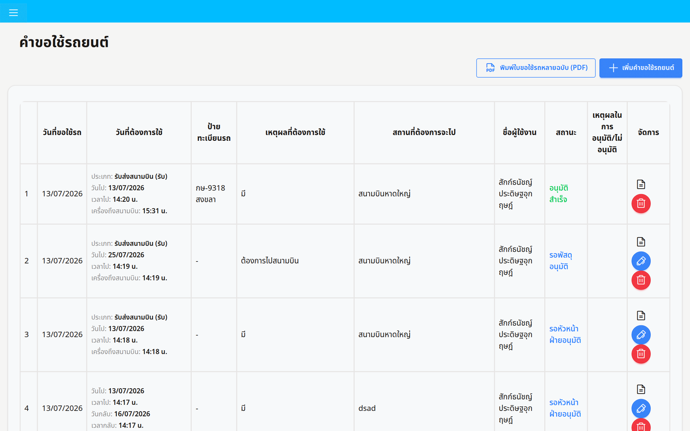

### Day 35 — ช่องค้นหาสิทธิ์การใช้รถ, Date Picker และการอุดช่องโหว่ความปลอดภัย
- **สิ่งที่ได้พัฒนา / ปรับปรุง:**
  - เพิ่มช่องค้นหาในหน้าสิทธิ์การใช้รถ และออกแบบ modal ใหม่ในหน้าสิทธิ์/ประวัติการใช้รถ `[vehicle_lending/car_permissions, vehicle_lending/history_car_lending]`
  - แก้การแสดงผลวันที่ใน date picker และเทมเพลต `[vehicle_lending/car_permissions]`
  - ปรับการ render ฟอร์มให้รองรับ dynamic styling และแสดง error message ตามเงื่อนไข `[procurement/requisitions]`
  - แก้ไขช่องโหว่ความปลอดภัย (CVE) ของ dependencies `[infra/dependencies]`
  - เริ่มต้นระบบ MAS (init MAS system) `[procurement/mas]`
- **รายละเอียดเชิงเทคนิค:**
  - อัปเดตไลบรารีที่มีช่องโหว่ที่ประกาศไว้ และตรวจว่าการเปลี่ยนเวอร์ชันไม่กระทบฟังก์ชันเดิม
  - ปรับ date picker ให้แสดงรูปแบบวันที่ตรงกับที่ระบบบันทึกจริง
- **การตัดสินใจเชิงสถาปัตยกรรมและตรรกะระบบ:**
  - ถือว่าการอัปเดตช่องโหว่เป็นงานระดับ Release-critical ต้องทำก่อนเพิ่มฟีเจอร์ใหม่
- **คุณภาพระบบ Backend / Frontend:**
  - ลดความเสี่ยงด้านความปลอดภัย และผู้ใช้ค้นหาสิทธิ์การใช้รถได้เร็วขึ้น
- **📸 ภาพหน้าจอประกอบ (Screenshot):**
  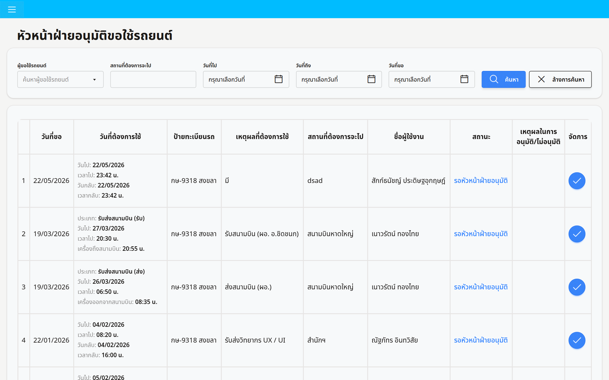

---

## Feature I: Manuals, Organization Switching & Automated Tests (Day 36 – 38)

### Day 36 — รายละเอียดการรับส่งสนามบินในเอกสารและการอัปเดต Dependencies
- **สิ่งที่ได้พัฒนา / ปรับปรุง:**
  - เพิ่มรายละเอียดการรับส่งสนามบิน (airport transfer) ในฟอร์มและหน้าแสดงผลใบเบิกรถ พร้อม mark required และวันที่กลับ `[vehicle_lending/car_applications]`
  - อัปเดต dependencies ของโปรเจกต์ `[infra/dependencies]`
  - ปรับความกว้างคอลัมน์ตารางใบเบิกรถ `[vehicle_lending/car_permissions]`
- **รายละเอียดเชิงเทคนิค:**
  - เพิ่มข้อมูลเที่ยวบิน/เวลารับส่งลงในเอกสารสำหรับพิมพ์ เพื่อให้คนขับใช้อ้างอิงได้จริง
- **การตัดสินใจเชิงสถาปัตยกรรมและตรรกะระบบ:**
  - ให้เอกสารพิมพ์มีข้อมูลครบเท่าที่หน้าจอมี ลดการสื่อสารเพิ่มทางช่องทางอื่น
- **คุณภาพระบบ Backend / Frontend:**
  - เอกสารขอใช้รถพร้อมช่องลงนามและข้อมูลการเดินทางครบถ้วนในหน้าเดียว
- **📸 ภาพหน้าจอประกอบ (Screenshot):**
  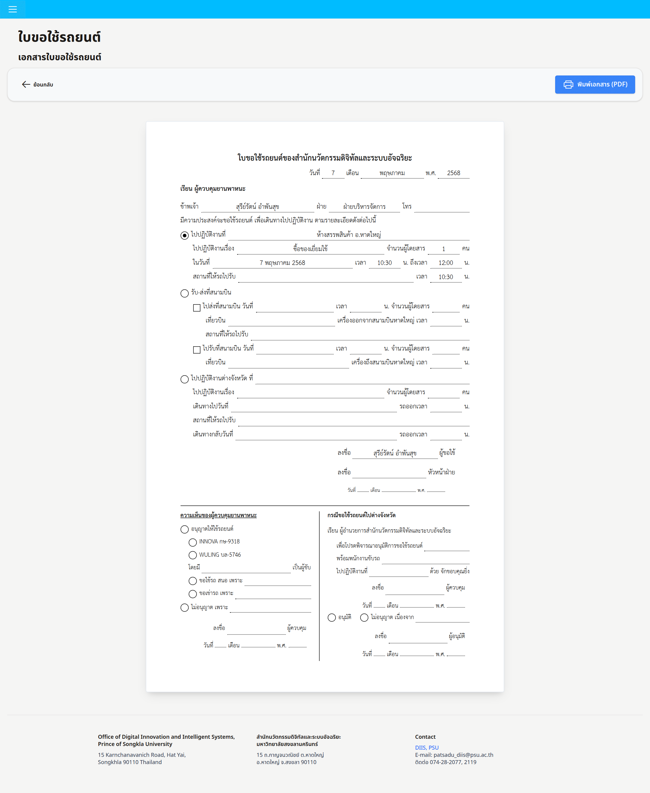

### Day 37 — คู่มือการใช้งานระบบใบเบิกรถยนต์
- **สิ่งที่ได้พัฒนา / ปรับปรุง:**
  - เขียนคู่มือการใช้งานใบเบิกรถยนต์ในระบบ `[vehicle_lending]`
  - แก้ layout หน้าคำขอ `[procurement/requisitions]`
- **รายละเอียดเชิงเทคนิค:**
  - ทำคู่มือเป็นหน้าเว็บในระบบ (in-app manual) แยกหัวข้อตามบทบาทผู้ใช้และขั้นตอนการทำงาน
- **การตัดสินใจเชิงสถาปัตยกรรมและตรรกะระบบ:**
  - เก็บคู่มือไว้ในระบบเดียวกับงาน เพื่อให้เนื้อหาอัปเดตไปพร้อมกับฟีเจอร์
- **คุณภาพระบบ Backend / Frontend:**
  - ลดคำถามซ้ำจากผู้ใช้ใหม่ และใช้เป็นเอกสารส่งมอบงานได้ทันที
- **📸 ภาพหน้าจอประกอบ (Screenshot):**
  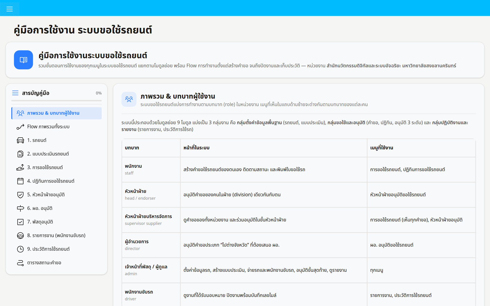

### Day 38 — คู่มือรถจักรยานยนต์, ระบบสลับหน่วยงาน และชุดทดสอบอัตโนมัติ
- **สิ่งที่ได้พัฒนา / ปรับปรุง:**
  - เขียนคู่มือการใช้งานใบเบิกรถจักรยานยนต์ `[vehicle_lending]`
  - พัฒนาระบบสลับองค์กร (organization switching) รองรับผู้ใช้ที่มีหลายหน่วยงาน พร้อมแก้ error message ตอนเลือกไซต์ `[accounts/organizations, procurement]`
  - ปรับปรุงฟีเจอร์ฟีดแบ็กการใช้รถ: ฟอร์มกรองตามรถ/ทริป, dashboard พร้อม animation, SVG star rating, แก้ layout `[vehicle_lending/car_feedback]`
  - เพิ่ม test suite และ backfill script สำหรับ car feedback พร้อมแก้ไขตาม PR code review `[vehicle_lending/car_feedback, tests]`
  - เพิ่มชุด agent/testing skills สำหรับเครื่องมือพัฒนา `[dev-tooling/skills]`
- **รายละเอียดเชิงเทคนิค:**
  - ระบบสลับหน่วยงานจำค่าหน่วยงานล่าสุดใน `user_setting` และตรวจสมาชิกภาพทุกครั้งก่อนใช้ค่าที่จำไว้
  - เขียนชุดทดสอบครอบคลุมทั้ง logic การสรุปผลและการแยกข้อมูลข้ามหน่วยงานของ car feedback
  - เขียน backfill script (`scripts/backfill_car_feedback_organization.py`) เติมฟิลด์ organization ให้ข้อมูลเดิม
- **การตัดสินใจเชิงสถาปัตยกรรมและตรรกะระบบ:**
  - ทุกฟีเจอร์ใหม่ที่แตะข้อมูลหลายหน่วยงาน ต้องมีเทสต์ยืนยันการแยกข้อมูล (Isolation Test) กำกับ
- **คุณภาพระบบ Backend / Frontend:**
  - ชุดทดสอบ car feedback ผ่านทั้ง **79 รายการ** ใช้เวลา 0.87 วินาที (ดูภาคผนวก)
- **📸 ภาพหน้าจอประกอบ (Screenshot):**
  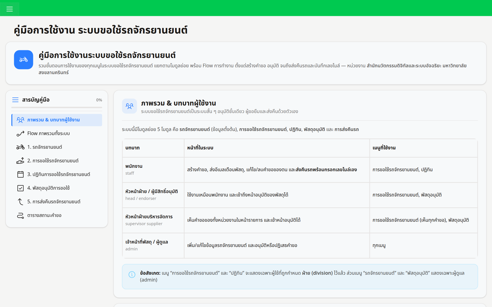

---

## 🔍 ตารางจับคู่วันทำงานกับโมดูลในโค้ด (Traceability Matrix)

| วัน | วันที่อ้างอิงใน git log | หมวดฟีเจอร์ | โมดูลที่แก้ไข |
| :--- | :--- | :--- | :--- |
| **Day 1** | 2025-08-25 | Feature A | `procurement/products` |
| **Day 2** | 2025-10-03 | Feature A | `procurement`, `procurement/macros`, `procurement/payment` |
| **Day 3** | 2025-10-09 | Feature A | `procurement/macros`, `procurement/payment` |
| **Day 4** | 2025-10-12 | Feature A | `procurement/upload_files`, `procurement/mas` |
| **Day 5** | 2025-10-27 | Feature B | `procurement/requisitions`, `procurement/suppliers` |
| **Day 6** | 2025-11-03 | Feature B | `procurement/requisitions`, `procurement` |
| **Day 7** | 2025-11-20 | Feature B | `procurement/base`, `procurement/requisitions` |
| **Day 8** | 2026-02-16 | Feature C | `procurement/mas`, `procurement/requisitions`, `procurement/products` |
| **Day 9** | 2026-02-19 | Feature C | `procurement/mas`, `procurement/requisitions` |
| **Day 10** | 2026-02-25 | Feature C | `procurement`, `procurement/suppliers` |
| **Day 11** | 2026-02-27 | Feature D | `vehicle_lending/car_applications`, `procurement/products`, `procurement/requisitions` |
| **Day 12** | 2026-03-05 | Feature D | `procurement/requisition_timeline`, `procurement/requisitions` |
| **Day 13** | 2026-03-06 | Feature D | `procurement/upload_files`, `procurement/mas`, `procurement/macros` |
| **Day 14** | 2026-03-09 | Feature E | `vehicle_lending/car_applications`, `procurement/requisitions`, `procurement/macros` |
| **Day 15** | 2026-03-17 | Feature E | `vehicle_lending`, `vehicle_lending/history_car_lending`, `procurement/macros` |
| **Day 16** | 2026-03-19 | Feature E | `procurement/mas`, `procurement/tor_years`, `vehicle_lending` |
| **Day 17** | 2026-03-31 | Feature E | `vehicle_lending/car_tasks`, `procurement/requisitions`, `procurement` |
| **Day 18** | 2026-04-01 | Feature E | `procurement/requisition_timeline` |
| **Day 19** | 2026-04-02 | Feature F | `procurement/products`, `procurement/requisitions`, `dev-tooling/skills` |
| **Day 20** | 2026-04-03 | Feature F | `procurement`, `procurement/requisitions`, `procurement/tor_years`, `procurement/requisition_timeline` |
| **Day 21** | 2026-04-07 | Feature F | `procurement/requisition_timeline` |
| **Day 22** | 2026-04-08 | Feature F | `procurement/requisition_timeline`, `procurement/mas` |
| **Day 23** | 2026-04-10 | Feature F | `procurement/requisition_timeline`, `procurement/mas`, `web/base` |
| **Day 24** | 2026-04-19 | Feature F | `procurement/requisition_timeline`, `procurement/requisitions`, `procurement/payment`, `accounts/organizations`, `procurement/upload_files` |
| **Day 25** | 2026-04-23 | Feature G | `vehicle_lending/car_feedback`, `procurement/requisitions`, `procurement/mas` |
| **Day 26** | 2026-05-16 | Feature G | `dev-tooling/skills` |
| **Day 27** | 2026-05-21 | Feature G | `procurement/item_orders`, `procurement/requisitions` |
| **Day 28** | 2026-05-22 | Feature G | `vehicle_lending/car_applications`, `procurement/requisitions` |
| **Day 29** | 2026-05-23 | Feature G | `procurement`, `procurement/suppliers`, `dashboard` |
| **Day 30** | 2026-05-24 | Feature G | `vehicle_lending/car_feedback`, `procurement/requisition_timeline`, `procurement/requisitions` |
| **Day 31** | 2026-05-27 | Feature H | `vehicle_lending/car_permissions`, `procurement/requisitions`, `procurement/requisition_timeline`, `project-config` |
| **Day 32** | 2026-05-31 | Feature H | `accounts/roles`, `procurement/requisition_timeline`, `procurement/requisitions`, `vehicle_lending/car_feedback` |
| **Day 33** | 2026-06-02 | Feature H | `vehicle_lending/car_permissions`, `vehicle_lending/car_applications`, `procurement/requisitions`, `procurement/requisition_timeline` |
| **Day 34** | 2026-06-04 | Feature H | `procurement`, `vehicle_lending`, `procurement/macros` |
| **Day 35** | 2026-06-06 | Feature H | `vehicle_lending/car_permissions`, `vehicle_lending/history_car_lending`, `procurement/requisitions`, `procurement/mas`, `infra/dependencies` |
| **Day 36** | 2026-07-13 | Feature I | `vehicle_lending/car_applications`, `vehicle_lending/car_permissions`, `infra/dependencies` |
| **Day 37** | 2026-08-17 | Feature I | `vehicle_lending`, `procurement/requisitions` |
| **Day 38** | 2026-08-18 | Feature I | `vehicle_lending/car_feedback`, `accounts/organizations`, `procurement`, `tests`, `dev-tooling/skills` |

---

## 🧪 สถานะการทดสอบระบบ (Test Status)

รันด้วย `venv/bin/python -m pytest` บนเครื่องพัฒนา (mongomock, 2026-08-24):

| ชุดทดสอบ | ผลลัพธ์ |
| :--- | :--- |
| `tests/test_car_feedback_logic.py` + `tests/test_car_feedback_views.py` (งานของรายงานฉบับนี้) | **79 passed** |
| ทั้งโปรเจกต์ (`pytest`) | **99 passed / 2 failed** |

รายการที่ยังไม่ผ่าน (อยู่ในโมดูลคู่มือระบบซึ่งไม่ได้อยู่ในขอบเขตงานของรายงานฉบับนี้ และควรตรวจสอบต่อ):
- `tests/test_inventory_manual_views.py::test_inventory_manual_cross_tenant_isolation`
- `tests/test_procurement_views.py::test_procurement_manual_unauthorized_org`

---

## 📎 ภาคผนวก: ภาพหน้าจอเพิ่มเติม (Appendix)

| ภาพ | คำอธิบาย |
| :--- | :--- |
| 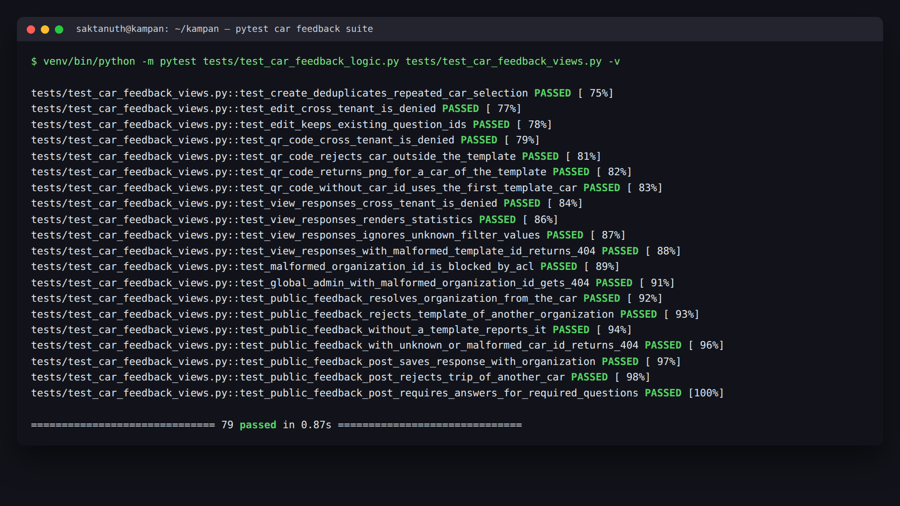 | ผลการรัน `pytest` ของชุดทดสอบ car feedback ผ่านทั้งหมด 79 รายการ |
| 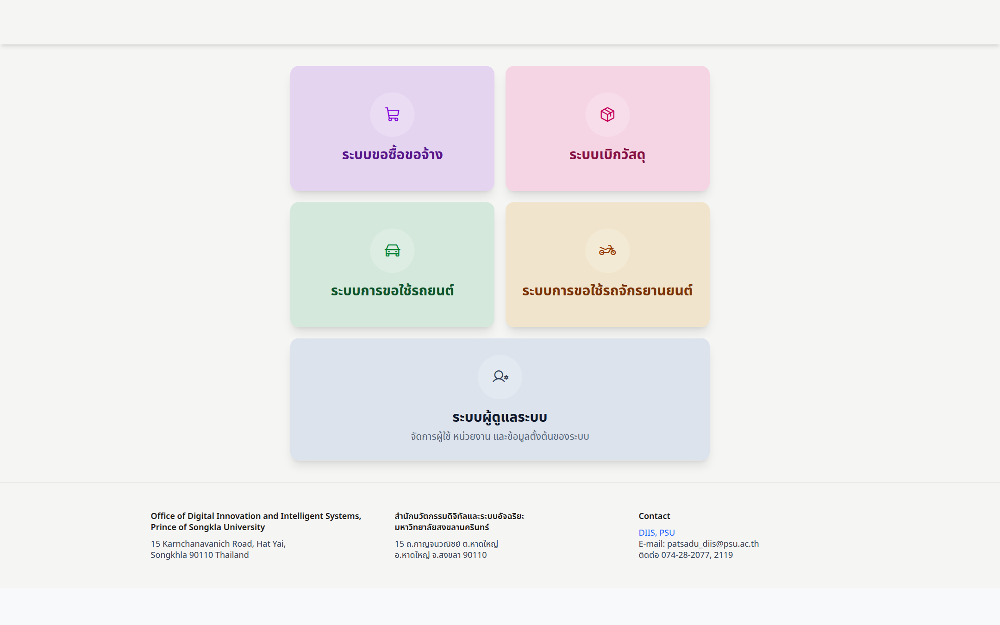 | หน้าเลือกระบบ (select system) ที่ใช้ร่วมกับระบบสลับหน่วยงาน |
| 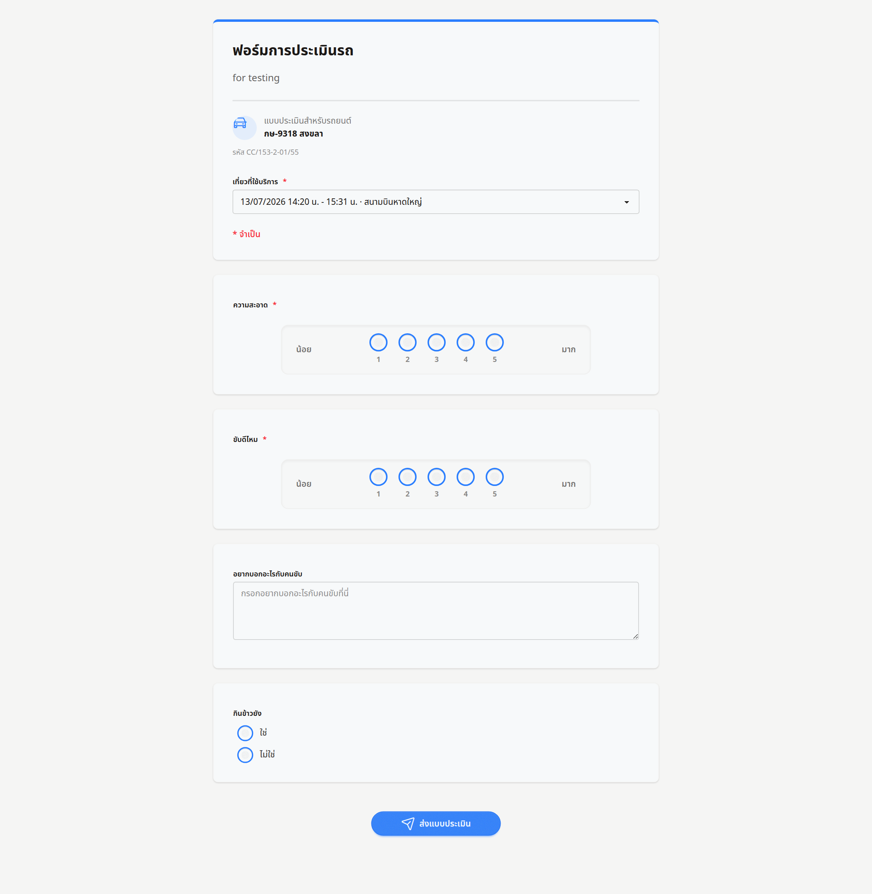 | แบบฟอร์มประเมินการใช้รถแบบสาธารณะ (เข้าผ่านลิงก์/QR ของรถแต่ละคัน) |
| 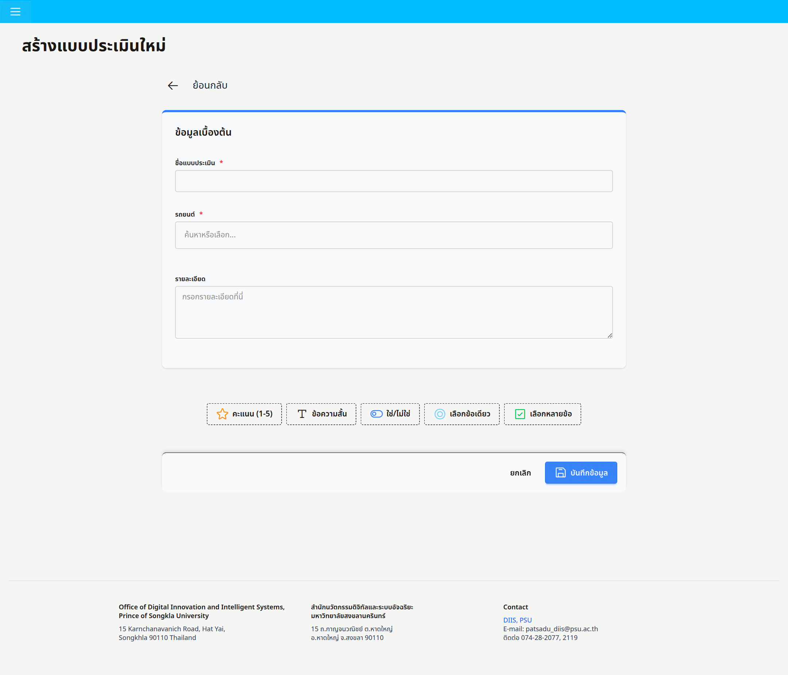 | หน้าสร้าง/แก้ไขแบบประเมินรถ รองรับคำถามหลายประเภท |
| 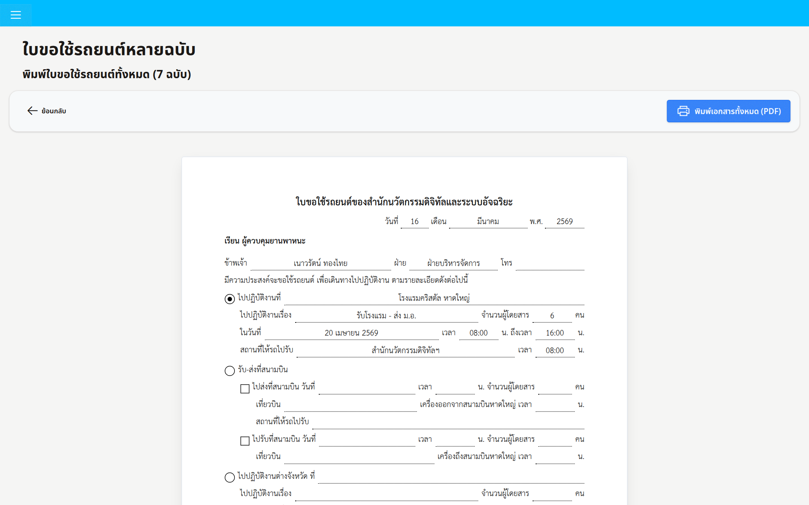 | หน้ารวมชุดเอกสารขอใช้รถสำหรับสั่งพิมพ์ตามช่วงวันที่ |
| 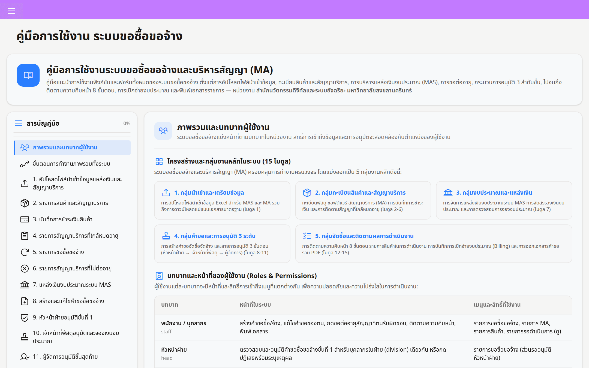 | หน้าคู่มือการใช้งานระบบจัดซื้อจัดจ้างในระบบ |

---

## 📷 ตารางอ้างอิงการแคปภาพหน้าจอ (Screenshot Capture Reference)

ภาพทั้งหมดแคปจากระบบที่รันบนเครื่องพัฒนา (`http://127.0.0.1:8081`) โดยเข้าสู่ระบบเป็นผู้ใช้เจ้าของรายงาน (`6710110432@psu.ac.th`) และดูข้อมูลของหน่วยงาน `สำนักนวัตกรรมดิจิทัลและระบบอัจฉริยะ ม.อ.` (`organization_id=6661c367df36be9c312058ae`) ทุก URL ด้านล่างต่อท้ายด้วยพารามิเตอร์ `organization_id` เดียวกัน

| วัน | ไฟล์ภาพ | URL Route ที่ใช้แคป |
| :--- | :--- | :--- |
| Day 1 | `day01_product_form_upload_validation.png` | `/procurement/products/create` |
| Day 2 | `day02_procurement_catalog_filter.png` | `/procurement/products` |
| Day 3 | `day03_payment_history_validation.png` | `/procurement/payment/<procurement_id>` |
| Day 4 | `day04_mas_procurement_upload.png` | `/admin/upload_files/create` |
| Day 5 | `day05_requisition_progress_filter.png` | `/procurement/requisitions` |
| Day 6 | `day06_email_templates_notification.png` | `/email_templates/` |
| Day 7 | `day07_sidebar_navigation.png` | `/procurement/requisitions` (เปิด sidebar + เลือกมุมมองผู้ดูแล) |
| Day 8 | `day08_mas_form_fields.png` | `/admin/mas/create` |
| Day 9 | `day09_mas_reservation_assignment.png` | `/admin/mas/<mas_id>/reservation` |
| Day 10 | `day10_supervisor_supplier_confirm.png` | `/approve_orders/supervisor_supplier` |
| Day 11 | `day11_car_application_airport_form.png` | `/vehicle_lending/car_applications/create` |
| Day 12 | `day12_timeline_log_search.png` | `/procurement/requisition_timeline` |
| Day 13 | `day13_upload_error_handling.png` | `/admin/upload_files/` |
| Day 14 | `day14_calendar_completed_status.png` | `/vehicle_lending/car_applications/calendar` (เลื่อนไปเดือน ก.พ. 2569) |
| Day 15 | `day15_history_mileage_filter.png` | `/vehicle_lending/history_car_lending` |
| Day 16 | `day16_admin_prefix_mas_routes.png` | `/admin/mas/` |
| Day 17 | `day17_car_tasks_return.png` | `/vehicle_lending/car_tasks` |
| Day 18 | `day18_completed_submit_running_number.png` | `/procurement/requisition_timeline/<timeline_id>/completed_submit` |
| Day 19 | `day19_requisition_form_components.png` | `/procurement/requisitions/create` |
| Day 20 | `day20_requisition_cancel_actions.png` | `/procurement/requisitions/non-renewal` |
| Day 21 | `day21_timeline_step_engine.png` | `/procurement/requisition_timeline/<timeline_id>/add_progress` |
| Day 22 | `day22_timeline_details_specified.png` | `/procurement/requisition_timeline/<timeline_id>/details_specified` |
| Day 23 | `day23_timeline_items_warranty.png` | `/procurement/requisition_timeline_items/` |
| Day 24 | `day24_timeline_export_modal.png` | `/procurement/requisition_timeline_items/` (เปิด modal ส่งออก) |
| Day 25 | `day25_car_feedback_page.png` | `/vehicle_lending/car_feedback` |
| Day 26 | `day26_dev_tooling_cleanup.png` | Terminal: `git show --stat 7ea6555` |
| Day 27 | `day27_requisition_document_layout.png` | `/procurement/requisitions/<requisition_id>/document` |
| Day 28 | `day28_calendar_event_modal.png` | `/vehicle_lending/car_applications/calendar` (คลิก event เพื่อเปิด modal) |
| Day 29 | `day29_multi_tenant_organization.png` | `/admin/organizations/` |
| Day 30 | `day30_feedback_dashboard_responses.png` | `/vehicle_lending/car_feedback/<template_id>/view` |
| Day 31 | `day31_car_table_ui.png` | `/vehicle_lending/cars` |
| Day 32 | `day32_user_roles_prefill.png` | `/admin/user-roles` |
| Day 33 | `day33_car_permission_assignment.png` | `/vehicle_lending/car_permissions/admin_page` |
| Day 34 | `day34_car_application_index_forms.png` | `/vehicle_lending/car_applications` |
| Day 35 | `day35_car_permission_search.png` | `/vehicle_lending/car_permissions/header_page` |
| Day 36 | `day36_airport_transfer_paper.png` | `/vehicle_lending/car_applications/<car_application_id>/paper` |
| Day 37 | `day37_car_manual.png` | `/vehicle_lending/car_manuals` |
| Day 38 | `day38_motorcycle_manual.png` | `/vehicle_lending/motorcycle_manuals` |

---

## 🎯 บทสรุปการส่งมอบงาน (Final Handover Conclusion)

ตลอดรอบการพัฒนา **38 วันทำการ (228 ชั่วโมง)** งานที่ส่งมอบครอบคลุมทั้งสามระบบหลักของ Kampan:

1. **ระบบจัดซื้อจัดจ้างและงบประมาณ** — ตั้งแต่การนำเข้าข้อมูลด้วย Excel ที่ตรวจสอบได้ (Day 1–4, 13), ระบบงบประมาณ MAS พร้อมการจองงบและล็อกข้อมูลหลังมอบหมาย (Day 8–9, 16), ไทม์ไลน์คำขอที่มี Step Engine, Audit Trail แบบ hash, ตัวกรอง, สิทธิ์ และการส่งออกข้อมูล (Day 12, 18–24) จนถึงเอกสารคำขอที่พิมพ์ใช้งานจริงพร้อมเลข running number (Day 18, 27)
2. **ระบบยานพาหนะ** — ฟอร์มขอใช้รถที่รองรับการรับส่งสนามบิน (Day 11, 36), ปฏิทินการใช้รถพร้อม modal โหลดจากเซิร์ฟเวอร์ (Day 14, 28), งานคืนรถและเลขไมล์ (Day 15, 17), การมอบหมายคนขับ/รถและสิทธิ์การใช้รถ (Day 33, 35) และระบบประเมินการใช้รถแบบไดนามิกพร้อมแดชบอร์ดสรุปผล (Day 25, 30, 38)
3. **ความปลอดภัยและคุณภาพระบบ** — บังคับใช้ Multi-Tenancy Scoping ทั้งระบบจัดซื้อ (Day 29), ตรวจสิทธิ์ตามบทบาทในหน่วยงานที่กำลังดู (Day 32), ระบบสลับหน่วยงานสำหรับผู้ใช้หลายสังกัด (Day 38), อุดช่องโหว่ CVE และอัปเดต dependencies (Day 35–36) พร้อมชุดทดสอบอัตโนมัติและ backfill script สำหรับข้อมูลเดิม (Day 38)

โค้ดทั้งหมดใช้ `DecimalField` สำหรับตัวเลขทางการเงิน, ทำ Query Scoping ตามหน่วยงานทุกจุดที่เข้าถึงข้อมูล, ใช้ WTForms เป็นชั้นตรวจสอบข้อมูลนำเข้า และใช้ Tailwind CSS + DaisyUI สำหรับ UI ที่ responsive พร้อมคู่มือการใช้งานในระบบสำหรับส่งมอบให้ผู้ใช้งานจริง

---

*หมายเหตุ: เนื้อหางานรายวันอ้างอิงจาก [worklog_saktanuthpeak.md](worklog_saktanuthpeak.md) ซึ่งสรุปมาจาก `git log` จริงของบัญชีนี้ และจัดกลุ่มให้เหลือ 38 วัน (6 ชม./วัน ตามที่กำหนดไว้ในเอกสารต้นทาง ไม่ได้คำนวณจากขนาด commit) ภาพหน้าจอทั้งหมดแคปจากระบบที่รันด้วยฐานข้อมูลพัฒนาจริง จึงสะท้อนหน้าจอปัจจุบันของ branch `kontuch-dev` ณ วันที่ 2026-08-24 หน้าจอบางหน้าที่ยังไม่มีข้อมูลตัวอย่างในฐานข้อมูลพัฒนา จะแสดงสถานะว่างของ UI ตามจริง*
